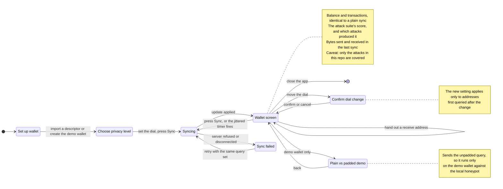
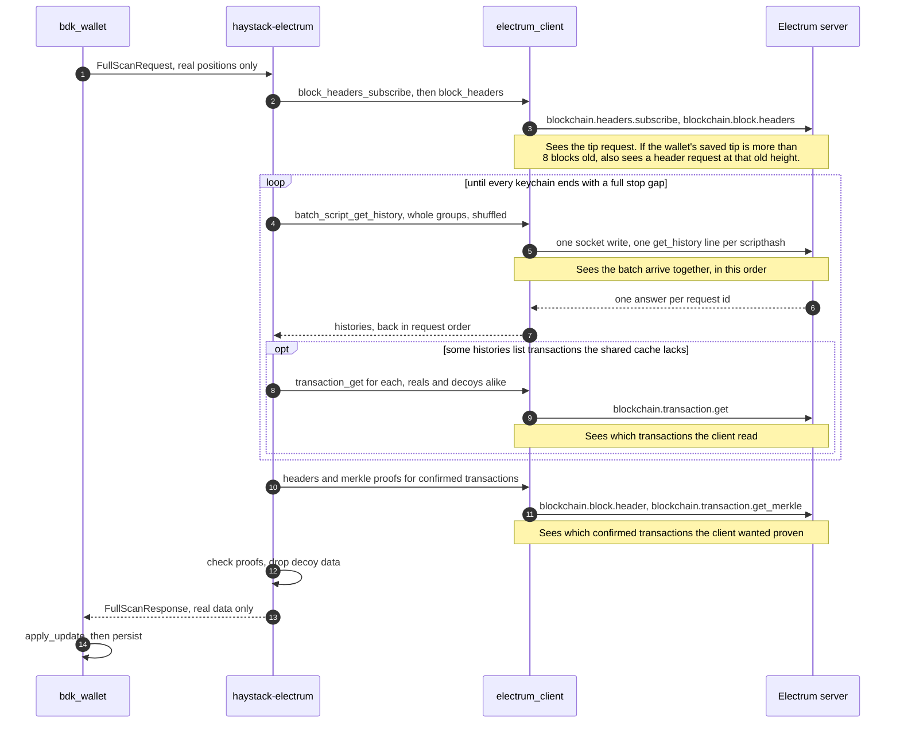

# Design

How the query gets built, the three attacks that break the obvious approaches, and the questions
still open. This is the document that should be most rewritten as implementation proceeds.

---

## The shape of the thing

```
                  ┌────────────────────────────────────────────┐
  descriptor ───► │ derive real scripthash set R               │
  (xpub)          │   bdk_wallet: reveal_addresses_to / peek   │
                  └───────────────┬────────────────────────────┘
                                  │
                  ┌───────────────▼────────────────────────────┐
  decoy pool ───► │ decoy selector (deterministic, append-only)│
  (chain-sourced) │   seed = f(account xpubs), NOT system RNG  │
                  └───────────────┬────────────────────────────┘
                                  │  Q = R ∪ D,  |Q| = padding × |R|
                  ┌───────────────▼────────────────────────────┐
                  │ query scheduler: order, batching, timing   │
                  └───────────────┬────────────────────────────┘
                                  │
                            Electrum server
                                  │  answers for all of Q
                  ┌───────────────▼────────────────────────────┐
                  │ local filter: discard D, apply R to wallet │
                  └────────────────────────────────────────────┘
```

The server does the same work it always did. The wallet throws most of the answers away. The cost is
bandwidth; the product is the adversary's uncertainty.

This sketch is the one-glance version. "The system in diagrams", further down, redraws it in detail:
every part and its status, what the user sees, one sync step by step and on the wire, and how the
attack harness turns a log of queries into a score.

---

## The three attacks that matter

### A1 — Intersection across rounds

Covered in `docs/00-problem.md` §6 with numbers. Summary: real addresses recur every round, fresh
decoys do not, so intersecting query sets recovers `R` exactly in about three rounds at any padding
factor.

Mechanically, the adversary tracks each scripthash across rounds rather than judging a query as a
whole (`analyse()` in `attack/a1.py`). A scripthash starts unseen, then is watched — queried in every
round since it first appeared. It leaves "watched" exactly two ways, and both expose it:

- **It goes missing from a later round.** A wallet never stops watching its own addresses, so
  anything that vanishes must be a decoy. This is the intersection attack above.
- **It goes from no history to some, while watched.** A payment landed on it. No decoy source can
  reproduce that rise — a random hash is never paid, and a chain-sourced decoy already had whatever
  history it started with — so the address is exposed with certainty the moment it activates. The
  calibration suite measures the cost on a wallet paid over 12 rounds: append-only decoys read 10.00%
  precision (chance) when this signal is ignored, and 20.20% when it is used. **This is a separate
  exposure mechanism from vanishing, and append-only decoys do nothing to stop it** — it is accepted
  as a stated limitation for this build, not solved.

**Mitigation: the decoy set is a deterministic function of the wallet's xpubs, and append-only.**

- Deterministic, so repeated queries are byte-identical and intersection yields nothing. Concretely,
  decoy `j` of a given position (a keychain and an index) is `HMAC-SHA256(key, keychain ‖ index ‖ j)`
  — a keyed hash, so the same key always reproduces the same decoys.
- Derived from the wallet's own public keys rather than the system RNG. Resolved 2026-09-28: the key
  is a tagged SHA-256 (tag `haystack/decoy-key/v1`) of the wallet's account xpubs, each in its 78-byte
  BIP32 encoding, sorted and deduplicated (`haystack-electrum/src/key.rs`). Every device watching the
  wallet, and every reinstall, arrives at the same key without being told it, and two wallets with
  different xpubs get unrelated decoys. The input is the xpub bytes, not the descriptor string,
  because one wallet's descriptor can be written more than one way (hardened steps as `84'` or `84h`).
  A different key changes every decoy at once, which the intersection attack reads as every decoy
  being withdrawn. For the same reason the ledger stores a fingerprint of the key and refuses to be
  used with a different one.
- **Note on what the key actually buys (added 2026-09-27).** It reads naturally to say "a keyed hash,
  so nobody without the key can reproduce the decoys" — as an earlier version of this document did —
  but that is circular for a watch-only wallet, where the key is derived from the xpub. Anyone who has
  the xpub can already derive every real address directly, which is a strictly shorter path to `R`
  than reproducing the decoy set. So key secrecy is not doing any of the defensive work here: an
  outside adversary who never sees the xpub can't reproduce the decoys regardless of whether the hash
  is keyed or not, and anyone who does see the xpub has already won by a shorter route. **What the key
  actually buys is determinism** — the same wallet always regenerating the same decoys, which is what
  makes A1's intersection defence work. The real security rests on A1 (append-only, so nothing ever
  withdraws) and A2 (structural indistinguishability), not on the key being a secret.
- Append-only, because the real set grows as addresses get revealed, and any withdrawal of a decoy
  creates an intersection signal. In practice, a position's decoy count is fixed the first time it is
  queried and never changes afterward, so moving the padding dial later only affects positions queried
  after the change. The count must be recorded before the decoys are sent, not after — a crash in
  between could otherwise hand the same position a different decoy set next time, which withdraws the
  first one.
- If decoys are drawn from a pool (see "Where decoys come from" below), each position must also pin
  the pool version it used. Resizing the pool would otherwise shift every hash-derived pick at once —
  a mass version of the same withdrawal signal.

**The delta corollary.** Intersection over rounds `1..t` cannot catch an address first queried at
round `t`. But the adversary can diff consecutive rounds and attack the *increment* directly. A
newly revealed real address is hidden only by decoys added in the same increment. So:

> **Every increment needs its own padding ratio.** Revealing one new address must add roughly
> `padding − 1` new decoys alongside it, in the same round.

This is the single most important structural constraint in the design and it is easy to miss.

### A2 — Structural distinguishability

A real wallet's address set has shape. Decoys sampled carelessly do not, and an adversary who knows
what that shape looks like can separate them without needing repetition at all:

| Property | Real set | Careless decoys |
|---|---|---|
| Derivation | sequential from one xpub; used indices cluster low with small gaps | unrelated |
| Script type | uniform (all P2WPKH, or all P2TR) | mixed |
| History depth | mostly 0, some 1–5, occasional heavy | whatever the sample had |
| Ratio used:unused | governed by the gap limit | arbitrary |

(Whether real addresses ever *co-spend* with each other is a stronger, separate signal — it needs
on-chain clustering, not just the shape of `Q` itself. See "A note on adversary strength" at the end
of this document.)

If decoys are separable on shape, a padding factor of 10 delivers close to 1. **The padding factor
is an upper bound on privacy, not a measurement of it** — which is exactly why the attack tool, not
the padding knob, is the real deliverable.

**Measured, not just argued.** `python3 -m attack calibrate` runs the structural classifier
(`attack/a2.py`) against several decoy designs already immune to A1 — deterministic and fixed —
averaged over 5 seeds at padding 10, where random guessing reads ~10%. Rows are synthetic, using
assumed feature distributions from `attack/synth.py`, so they test the attack rather than Haystack;
the ordering is the real result:

| Decoy design (all already defeat A1) | Precision once shape is checked | What exposed it |
|---|---|---|
| Random scripthashes | 29.59% | Used reals stand out — random decoys never have transactions. |
| Careless chain-sourced addresses | 79.85% | The unused tail and the script type. |
| Decoy wallets of the real wallet's own shape (oracle) | 9.27% | Nothing — the target, and only buildable by an experimenter who already knows the real wallet's shape. |

**Mitigation direction (open).** Decoys should be drawn as *coherent synthetic wallets* rather than
as loose addresses — sample a real xpub-shaped cluster from chain data, or generate plausible ones,
so each decoy group has internally consistent derivation structure, uniform script type, and a
believable used/unused ratio. Then `Q` looks like several wallets, not one wallet plus confetti.

This is the hardest unsolved part of the design and where the most time should go.

### A3 — Timing and behavioural correlation

- Wallets typically sync immediately after receiving a payment. A sync that closely precedes or
  follows a mempool arrival for a queried address is a strong signal.
- The query burst is currently in derivation order (see the `.inspect()` output from
  `~/bdk_wallet/examples/electrum.rs:54`). Order alone can separate real from decoy: a structural
  model that also weighs position in the query reads 100.00% precision on an otherwise
  well-shaped decoy set sent reals-first, against 9.27% when the same set is shuffled (both
  synthetic, `python3 -m attack calibrate`).
- Repeated syncs at a fixed cadence identify the wallet across IP changes.

**Mitigation direction.** Shuffle query order within the set; batch reals and decoys together rather
than sequentially; decouple sync timing from wallet events. Cheap to implement, and easy to forget.
The timing half is resolved in detail in "Sync scheduling: when `Q` gets sent," further down.

---

## Where decoys come from

Options, roughly in increasing order of quality and cost:

1. **Random scripthashes.** Free, and useless — no history at all, so trivially separable (A2).
2. **Mempool-sourced addresses.** What the problem statement suggests. Live, real, plausible
   individually. But a mempool sample skews toward exactly-one-recent-transaction and mixed script
   types, so it is separable in aggregate.
3. **Historical chain-sourced addresses.** Sample addresses with realistic history distributions
   from past blocks. Needs a local index or an API, and raises its own question: fetching the decoy
   pool is itself a query that could leak.
4. **Synthetic coherent wallets.** Generate decoy groups with real derivation structure. Strongest
   against A2, most work, and needs care that the generator's own statistical signature is not a
   fingerprint.

**Current lean: (3) as the pool, assembled into (4)-shaped groups.** Decide by measurement — build
the attack tool first and let it rank the options.

**Open problem: pool acquisition.** Where the decoy pool comes from must not itself leak. Bundling a
static pool with the wallet means every Haystack user shares decoys, which is either a strength
(a shared anonymity set) or a fatal flaw (the adversary knows the entire pool and subtracts it).
**This needs resolving before the design is credible** — see open questions below.

**Resolved 2026-09-27, for Week 2 only: option 5, HMAC-direct, for positions with no history yet.**
Decoy `j` of a position is derived from `HMAC-SHA256(key, keychain ‖ index ‖ j)`, with no pool lookup
at all. **Shape-matched, resolved 2026-09-28:** the HMAC output fills a script of the same type as the
real script at that position — for the demo wallet's P2WPKH, `OP_0` followed by the first 20 HMAC
bytes — and the server is queried for that script's scripthash. The earlier wording, "send the HMAC
output directly as the scripthash", can't be built on the normal client call:
`batch_script_get_history` takes scripts and hashes them itself (`electrum-client` 0.24.1,
`types.rs:109`). On the wire nothing changes, since the server receives a 32-byte scripthash either
way. A real script keeps reals and decoys on one code path, and gives every decoy the wallet's own
script type, which the session log records for the structural attack. Only the real script's type is
read, never its hash, so a decoy reveals nothing about the address it covers. Using 20 of the 32
HMAC bytes leaves the chance that a decoy matches an address anyone has used at about (used
addresses) ÷ 2¹⁶⁰: with 10⁹ used addresses, 10⁹ ÷ 1.46×10⁴⁸ ≈ 7×10⁻⁴⁰. This is not a repeat of
option 1 above: option 1 fails because *some* real
addresses in `Q` have transaction history and no decoy ever does, so any non-zero history stands out
(the 29.59% row in "Measured, not just argued" above). That gap only exists when the real side has
history to contrast against. For a position that has never been paid — the demo wallet's entire
address set, and any freshly-revealed position in a longer-lived wallet — the matching real address
also has zero history, so there is nothing to contrast, and `docs/03-metric.md`'s calibration confirms
this design scores at the padding ceiling for that case. It also has no pool to fetch, version, or
subtract, which removes the open problem above entirely for the positions it covers.

**What this does not cover, and what Week 3 must replace it with.** A bare hash can never acquire
transaction history, so it cannot cover: (a) a position that already has history the first time it is
queried — a restored or imported wallet — which needs option 3 or 4's real chain-sourced history from
the first query onward, or (b) a position that gains history while Haystack is already covering it.
Case (b) is the activation attack (A1 above), already an accepted limitation independent of decoy
source — HMAC-direct doesn't make it worse, and no decoy source fixes it without decoys that
themselves acquire history on the wallet's own schedule, which none of the options here can do. Case
(a) is new work: Week 3's chain-sourced pool / synthetic wallets must cover it before a restored wallet
can be scored at anything but chance.

---

## Parameters

| Parameter | Meaning | Notes |
|---|---|---|
| `padding` | `|Q| / |R|` | The user-facing dial. 1.0 = plain Electrum. |
| `increment_padding` | decoys added per newly revealed real address | Must track `padding`; see the delta corollary. |
| `pool_size` | size of the decoy universe | Bigger is better for A1 arithmetic; bounded by acquisition cost. |
| `group_size` | addresses per synthetic decoy wallet | Should resemble a real wallet's revealed-set size. |
| `order` | query ordering | Shuffled, not derivation order. |

---

## Sync integration: how `Q` reaches the wire

Resolved 2026-09-16, against the actual `bdk_electrum` source (`~/bdk/crates/electrum/src/bdk_electrum_client.rs`)
and `bdk_core::spk_client` (`~/bdk/crates/core/src/spk_client.rs`), both available locally. Rechecked
2026-09-24 against the published versions this repo builds with; see "Which upstream version to
copy" at the end of this section.

**The problem.** `BdkElectrumClient::full_scan`/`sync` (what `~/bdk_wallet/examples/electrum.rs:66,117`
calls) is a closed box: it takes a `FullScanRequest`/`SyncRequest` built from the wallet's own
keychains, decides internally which scripthashes to query (honouring `STOP_GAP`), does the network
I/O, and returns a finished `Update`. There is no seam in that call for "send `R ∪ D`, then strip `D`
out of the response before building the `Update`." Padding has to sit *inside* that box, not around it.

**The decision: write a sibling crate, not a fork.** Everything `BdkElectrumClient` is built from is
already public — the `electrum_client::ElectrumApi` trait (external crate: `batch_script_get_history`,
`transaction_get`, `batch_block_header`, `batch_transaction_get_merkle`) and `bdk_core::spk_client`'s
`FullScanRequest`/`SyncRequest`/`FullScanResponse`/`SyncResponse`/`TxUpdate`/`CheckPoint`, all with
public builders. `bdk_wallet::Update` has `From<FullScanResponse<KeychainKind>>` and `From<SyncResponse>`
impls, and `apply_update(impl Into<Update>)` takes either. In `bdk_wallet` 2.1.0 — the version this
crate targets, and the one `capture/` already builds against (see "Which upstream version to copy"
below) — these are at `src/wallet/mod.rs:118,130,140` and `:2353`. So a
new crate that reimplements `full_scan`/`sync` against the same public surface, with decoy injection
added, plugs into `wallet.apply_update()` completely unchanged — no fork of `bdk_electrum`, no changes
to `bdk_wallet`.

**Where decoys go.** The hook is the batching loop in `populate_with_spks` (lines 270–330 of the
published 0.23.2, or 284–347 in the `~/bdk` clone). Each batch entry needs to carry its own type —
`Real(u32, ScriptBuf)` for a wallet-derived spk (index meaningful for `stop_gap`/`last_active_index`)
or `Decoy(DecoyId, ScriptBuf)` (no place in that index space) — interleaved and shuffled per the A3
mitigation. Send the merged batch through **one** `batch_script_get_history` call, zip the response
back against the tags, and feed only the `Real` partition into the existing stop-gap/anchor/`fetch_tx`
bookkeeping, unchanged from upstream. The `Decoy` partition is handled separately and never reaches the
`Update`.

**Four engineering gotchas found by reading the code, not by guessing.** The first two came from
reading `bdk_electrum`. The last two came from drawing the diagrams in the next section against
`bdk_wallet` 2.1.0 and the published `bdk_electrum` 0.23.2.

1. **Decoy hits need the same follow-up calls a real address would get** (`fetch_tx`,
   `batch_fetch_anchors`), not just `get_history`. If a decoy scripthash shows 3 known transactions and
   the client never fetches any of them, that call-pattern gap is itself a signal to a chain-aware
   adversary — "queried address with history, zero follow-up reads" doesn't look like an owned
   address. So the bandwidth cost of
   padding scales with **decoy history depth**, not just decoy count. `docs/03-metric.md`'s
   bandwidth-versus-score curve needs to measure this, not assume flat per-decoy cost.
2. **Decoy tx data must never reach the `Update`.** `wallet.apply_update()` inserts `TxUpdate.txs` into
   the wallet's `TxGraph`; since decoy scriptpubkeys were never derived from the wallet's own
   descriptor, any decoy tx that leaks through sits there unindexed — silent local-storage bloat that
   grows every sync, not a balance bug, but worth its own regression test: assert the sqlite/`TxGraph`
   size after a padded sync contains exactly the real transactions.
3. **The transaction cache must treat reals and decoys the same way, including after a restart.**
   `fetch_tx` asks the server only for transactions missing from its cache (0.23.2
   `bdk_electrum_client.rs:71`). bdk's example fills that cache from the wallet's stored transactions
   before each sync (`~/bdk_wallet/examples/electrum.rs:52`). Decoy transactions are never stored in
   the wallet, because of the previous rule. So on the first sync after a restart, the client would
   re-fetch every decoy transaction and no real one. The server knows which scripthashes each
   transaction touches. So the used scripthashes whose transactions were not re-fetched are exactly
   the used real ones. For example, if 8 real addresses and 90 decoys have history, the server sees
   re-fetches for the 90 and none for the 8. The fix is a cache that `haystack-electrum` owns and
   saves for reals and decoys alike, kept outside the wallet's `TxGraph`. The merkle-proof cache
   (`populate_anchor_cache`, line 44) needs the same treatment.
4. **A decoy must appear and disappear together with the real position it covers.** `bdk_wallet`'s
   usual pattern is one full scan, then syncs of revealed positions only
   (`start_sync_with_revealed_spks`, `bdk_wallet` 2.1.0 `src/wallet/mod.rs:2595`). A full scan
   reveals positions only up to the last used index, because `apply_update` calls
   `reveal_to_target_multi(&update.last_active_indices)` (line 2363). So the unused tail drops out of
   every sync and comes back at the next full scan. For the never-paid demo wallet, that is 100
   scripthashes in the full scan and, once `next_unused_address` has revealed external index 0, 1 in
   the next sync. Two naive responses both fail:

   - If the decoys stay while the tail leaves, the scripthashes that vanish are exactly the wallet's
     unrevealed positions: its next receive and change addresses (`docs/00-problem.md` §5).
   - If decoys vanish on any schedule of their own, the ones that vanish are exposed as decoys by the
     intersection attack.

   What survives both is sending each decoy exactly when its real position is sent, which attaching
   decoys to positions does (A1's mitigation above). Two scan policies satisfy that.

   **Resolved 2026-09-25: every sync is a full scan (policy A).** Nothing ever leaves the query, so
   the attack harness's current rule, "anything that goes missing is a decoy" (`attack/a1.py`), stays
   sound with no rework. The cost is the tail on every sync: 100 positions, which is 1,000
   scripthashes at padding 10 with the 50-address gap limit `capture/` uses, even for a wallet that
   has never been paid.

   **The alternative, bdk's own pattern (policy B), is kept in `docs/04-roadmap.md` as a stretch
   goal**, not built into this design. Under it the tail and its decoys would leave at each sync and
   come back unchanged at each full scan, saving the tail's bandwidth on syncs. But the harness's
   current rule is wrong for that pattern, because a tail position that returns looks like a withdrawn
   decoy. A one-off run of the current attack code (not in the repo) shows both ways it fails, using
   10 revealed and 40 tail positions over full scan, sync, sync, full scan. Plain Electrum stops with
   `Infeasible: 50 reals required; 0 certain, 10 possible` instead of reading 0. Append-only decoys
   that stay while the tail leaves score 2.17% precision, which the harness caps at the 3.32-bit
   ceiling, although an attacker who watched the tail leave and return would pick out all 40 tail
   positions. So policy B needs the attack reworked to group scripthashes by their whole pattern of
   presence across rounds, not only by the round they first appeared, before it can ship — which is
   why it stays a stretch goal rather than the default.

**Which upstream version to copy.** Resolved 2026-09-26: the new crate targets `bdk_wallet` 2.1.0,
the published, stable release from crates.io. It is not built against the local `~/bdk_wallet`
checkout, which is a personal fork at version 3.1.0 — a version that exists only in that checkout,
not in the crates.io registry cache this machine has fetched from (confirmed by listing
`~/.cargo/registry/src/`: only `bdk_wallet-2.1.0` is there). `capture/Cargo.lock` already resolves
`bdk_wallet` 2.1.0, `bdk_electrum` 0.23.2, `bdk_chain` 0.23.3, `bdk_core` 0.6.3 and `electrum-client`
0.24.1, and this is the toolchain that produced the real capture fixture in `tests/fixtures/`, so the
query engine builds against a dependency set already proven to work end to end. Standardising on one
version also removes a recurring source of drift in this document: three separate places above used
to carry two sets of `mod.rs` line numbers, one per version, because the local fork and the published
crate don't stay in step line-for-line even when the public API is unchanged.

The new crate must resolve the same `bdk_core` minor version, 0.6, that `bdk_wallet` 2.1.0 uses. Rust
treats one type from two versions of a crate as two different types, so a response built against a
different `bdk_core` would not convert into `bdk_wallet`'s `Update`, and the code would not compile.
The local `~/bdk` clone (a separate checkout of `bdk_chain`/`bdk_electrum`/`bdk_core`, used only for
reading source, never as a build target) is unreleased master, and it differs from the published
0.23.2 in two ways that matter here:

- Master's full scan covers every revealed position before it starts counting the stop gap
  (`FullScanRequest::last_revealed`). Published `bdk_core` 0.6.3 has no such method, so code copied
  from master won't compile against `bdk_wallet` 2.1.0.
- Master's `fetch_tx` rejects a transaction whose computed txid (transaction id) differs from the
  one requested. Published 0.23.2 accepts whatever the server sends and caches it under the
  requested txid.

So copy 0.23.2's structure, and port master's txid check by hand. Without that check, a hostile
server could answer a request for one transaction with a different one.

This resolves what was previously an implicit assumption (the "Electrum server" box in the diagram
above). It does not resolve the open questions below, all of which are still live.

---

## The system in diagrams

Added 2026-09-24, based on the sibling-crate decision in "Sync integration" above. Four diagrams
draw the product Haystack will be built as. The attacks and the attack harness are covered in prose
instead, in "The three attacks that matter" above, rather than as separate diagrams here:

1. The whole system on one page: every part, and which way data moves between them.
2. What the user sees: the demo wallet's screens, and what each action costs.
3. One sync inside `haystack-electrum`: the new crate's work, step by step.
4. One sync on the wire: every message, and what the server can record from it.

Every code reference below was checked on 2026-09-24 against this repo and against the crate
versions that `capture/Cargo.lock` resolves: `bdk_wallet` 2.1.0, `bdk_electrum` 0.23.2 and
`electrum-client` 0.24.1, read from `~/.cargo/registry/src/`. Every number names the fixture or the
command it came from. Numbers drawn from the attack code describe it as it stood on 2026-09-24 and
may drift as that code changes.

**The metrics are still open** in `docs/03-metric.md`, including which number leads — diagram 2 below
shows where that choice surfaces in the UI.

The scan policy is resolved: every sync is a full scan (gotcha 4 in "Sync integration" above).
Diagrams 2 and 3 are drawn for that. The alternative, bdk's own pattern, is kept in
`docs/04-roadmap.md` as a stretch goal, and each diagram notes in passing what it would change.

### Terms these diagrams use

- A **script pubkey** is the locking script in a transaction output, and an address is one way of
  writing it down. bdk's type for it is `ScriptBuf`, and bdk's function names shorten it to "spk".
- A **scripthash** is `sha256(script pubkey)` with its bytes reversed. It is what an Electrum server
  is asked about. It is public and unkeyed, so it identifies an address as well as the address itself
  does (`docs/00-problem.md` §1).
- A **descriptor** is a string that says how to derive every address of a wallet from its public
  key. The demo wallet's receive descriptor in `tests/fixtures/bdk-capture-truth.json` is
  `wpkh([bd0f62bc/84'/0'/0']xpub6DHE…/0/*)`, where the xpub is the extended public key that all its
  addresses are derived from.
- A **keychain** is one derivation branch of a descriptor wallet. The external keychain (`/0/*`)
  holds receive addresses, and the internal keychain (`/1/*`) holds change addresses.
- A **position** is a keychain plus an index, such as "external, index 7". Each position has exactly
  one real script pubkey.
- The **stop gap**, also called the gap limit, is how many unused positions in a row a scan accepts
  before it decides the keychain holds nothing more. `capture/` uses 50, so a wallet that has never
  been paid queries 50 + 50 = 100 scripthashes per scan. All 6 rounds in the capture fixture contain
  exactly 100.
- A **full scan** walks each keychain from index 0 until the stop gap. A **sync**, in bdk's sense,
  queries only the positions the wallet has already revealed, meaning handed out or seen used.
- A **round** is one sync session on one connection. The attack harness treats each connection as
  one round.
- A **decoy** is a scripthash the wallet does not own and queries only to hide the real ones. `R` is
  the set of real scripthashes, `D` is the set of decoys, and `Q = R ∪ D` is what gets sent.
- **Padding** is `|Q| / |R|`, and it is the user's dial. Padding 10 on the 100-scripthash demo wallet
  means 900 decoys and 1,000 queries per round.
- A **batch** is the group of requests the client writes to the socket in one go before it waits for
  the answers. `capture/` and bdk's example use batches of 5.
- An **anchor** is bdk's record that a transaction is confirmed in a particular block. The client
  creates one only after checking a **merkle proof**, a short list of hashes that proves the
  transaction is included in that block.
- The **Update** is what `wallet.apply_update()` consumes: new transactions, their anchors, the new
  chain tip, and the last used index on each keychain. A `FullScanResponse` converts into one.

### Which parts exist and which are planned

The diagrams mix parts that exist with parts that don't. Diagram 1 shows each part's status by the
style of its border:

- A solid border means the part exists in this repo today. That covers `capture/`, the honeypot, the
  attack harness, and `haystack-electrum`'s client, decoy selector, ledger and session log. Updated
  2026-09-29: those four are now built, so they are solid; the shared cache was agreed after this
  diagram was drawn, so it is dashed rather than dotted.
- A dashed border means an earlier section of these docs decided to build it, and no code exists
  yet.
- A dotted border means this section proposes it for the first time. Each proposal says why it is
  needed, and none has been agreed yet. The one dotted arrow, the live score reaching the UI, is a
  proposal too.

### 1. The whole system on one page


This picture answers where each part of Haystack runs, which parts the user has to trust, and which
way each piece of data travels.

The product path runs in five steps:

1. The user sets the dial in the demo UI, and the dial sets the padding.
2. `bdk_wallet` builds a `FullScanRequest` that lists its real positions, exactly as it does today.
   It does not know Haystack exists.
3. The decoy selector looks up each position in the decoy ledger. A position the server has already
   seen keeps the decoys it had. A new position gets `padding − 1` new decoys, picked from the pool
   by a keyed hash of the wallet's xpubs, so the same wallet always gets the same decoys (A1's
   mitigation above).
4. `haystack-electrum` sends each real scripthash together with its decoys, shuffled, and collects
   every answer.
5. It keeps only the real answers and hands `bdk_wallet` a `FullScanResponse`, which
   `wallet.apply_update()` accepts unchanged.

The server is the only part on the far side of the trust boundary. It receives every scripthash in
`Q` and answers all of them. The design assumes it answers honestly. A lying server is out of scope
(`docs/01-threat-model.md`), because it can already show any client a false balance.

The measurement path exists today in three forms (updated 2026-09-29). For plain syncs,
`capture/` runs real `bdk_wallet` full scans against the honeypot and records what the wallet itself
sent, which is the ground truth; `scripts/honeypot_electrum.py` records what arrived at the server,
which is the adversary's view; and `python3 -m attack tripwire` checks the two against each other,
passing all four of its checks against the committed fixtures. For padded syncs, `capture/ --padding
10 --session …` does the same through `haystack-electrum` and also writes the session log. For a
paid wallet, which neither the honeypot nor the public demo seed can ever be, `regtest/` runs
`bitcoind` and `electrs` on a local regtest chain and gives a wallet a real history (receives,
address reuse, a batched payout, a two-input spend with change, unconfirmed transactions, a
reorganisation); `regtest/tests/gate.rs` requires padded and plain scans of it to leave the wallet
identical. `capture/README.md` and `attack/README.md` have the exact commands and the
current numbers — this stays here only as a pointer, so the five-step product path above has
something real to contrast against.

The session log exists (built 2026-09-29, `haystack-electrum/src/session.rs`) because the honeypot
can't measure real decoys. The honeypot answers
"nothing found" to every query. Decoys drawn from the chain have real history, and the structural
attack needs the server's view of that history: each scripthash's transaction count and script type
(`Fact` in `attack/observe.py`). The Haystack client receives exactly those answers, and it also
knows which entries were real. So it can write both inputs of the harness into one file. The
honeypot then becomes an independent check that the session log matches what a server really
received. The same log can feed the live score in the UI, by letting the harness attack the user's
own session.

Worked example: the demo wallet has never been paid, so a full scan covers positions 0 to 49 on both
keychains, which is 100 real scripthashes. At padding 10 each position carries 9 decoys, so each sync
sends 1,000 scripthashes and throws 900 of the answers away. Plain Electrum would send the 100. The
correctness gate in `docs/04-roadmap.md` requires the wallet's balance and transactions to come out
identical either way.

### 2. What the user sees



This picture answers what a person using the demo wallet does, what each action costs them, and what
the screen tells them.

- **Set up.** The user imports a descriptor or creates the demo wallet. The demo wallet uses a public
  seed, like `capture/`'s `haystack-capture-demo`, so anyone can reproduce its numbers.
- **Choose a privacy level before the first sync.** The dial sets the padding. The screen shows the
  cost before the user commits: for the demo wallet, padding 10 means 1,000 scripthashes per sync
  instead of 100.
- **Wallet screen.** It shows four things after every sync:
  - The balance and transactions, which must match a plain sync exactly.
  - The score from running the attack suite on this wallet's own session, together with the list of
    attacks that produced it, in plain words such as "compared every sync" or "also checked what real
    wallets look like".
  - The bytes sent and received in the last sync.
  - The caveat from `docs/03-metric.md`: the score covers only the attacks in this repo, and an attack
    nobody wrote does not show up in it.
- **What the score says.** The headline number is precision in bits: how much better than a same-size
  random guess the attacker's top guesses do, `-log2(precision)`. Plain Electrum reads 0.00 bits — the
  attacker's guess is certain. For the demo wallet at padding 10 with fixed decoys, the attacker's
  precision matches a random guess exactly, 10.00% either way, so it reads the full
  `log2(10) = 3.32` bits (the fixed-decoy table printed by `python3 -m attack tripwire`).
  `docs/03-metric.md` has the full metric set and the reasoning for leading with this one.

**Why the dial is set once.** An address's protection is fixed by the decoys that were first queried
alongside it. A decoy added later has a later first-seen round. If the attacker knows how many real
addresses first appeared in each round, a late decoy protects nothing that came before it. With a
fixed padding it can work that count out, by dividing the number of new queries by the padding. The
attack harness grants the count outright, and whether it should is open question 3 in
`docs/03-metric.md`. The table below comes from the repo's own attacker: `attack.calibrate.run`,
comparing every sync, with 100 real scripthashes, fixed random decoys and 8 rounds, run from a
scratch script that is not in the repo yet. Notice that only the first two rows get the protection
their query size suggests.

| Dial history | Queries in the last round | Attacker's precision | Random guess |
|---|---|---|---|
| Padding 5 throughout | 500 | 20.00% | 20.0% |
| Padding 10 throughout | 1,000 | 10.00% | 10.0% |
| Padding 5 for four rounds, then raised to 10 | 1,000 | 20.00% | 10.0% |
| Padding 10 for four rounds, then lowered to 5 | 500 | 20.00% | 20.0% |

Raising the dial doubled the bandwidth and protected nothing that already existed. Lowering it made
four rounds at padding 10 worthless, because the withdrawn decoys identified themselves as decoys.
That second result doesn't depend on the count: a decoy that goes missing is exposed by the
intersection attack alone. So the rule is that a dial change applies only to positions first queried
after the change (A1's mitigation above). Existing positions keep their decoys forever, so lowering
the dial saves no bandwidth for them. The confirm step tells the user both facts before they commit.

- **Receiving a payment** exposes the paid address with certainty — the activation attack described
  under A1 above. The screen should show the resulting drop in score. Nothing in the current design
  prevents it.
- **Handing out a new address** changes nothing on the wire. The address is already inside the tail,
  so it has been queried with its decoys since the first full scan, and every sync is a full scan. New
  positions appear only when a payment moves the last used index forward, as in the third sync of
  diagram 3's worked example. Each new position arrives with `padding − 1` new decoys first seen in
  the same round. That is the delta corollary from the intersection attack (A1 above), applied
  automatically.
- **Choosing when to sync.** A sync right after the user hears about a payment links the sync to the
  payment, which is the timing attack (A3 above). The private default is a timer with a
  memoryless random delay, resolved in "Sync scheduling: when `Q` gets sent" below. Manual sync stays
  available, and the screen says what its timing reveals.
- **Sync failed.** Public servers already refuse oversized requests (`docs/04-roadmap.md`, "Risks").
  A retry sends the same positions with the same decoys, so it reveals nothing new.
- **Plain versus padded demo.** The roadmap's side-by-side demo sends the unpadded query, which is
  the leak itself. So it runs only on the demo wallet against the local honeypot, and never on a real
  wallet against a public server.

### 3. One sync inside haystack-electrum


This picture answers what the new crate does and in what order, which steps are copied unchanged
from `bdk_electrum` 0.23.2, and where the four gotchas in "Sync integration" turn into code. Every
sync is a full scan (gotcha 4), so a sync and a full scan are the same operation here.

- **Load state.** The crate reads the wallet's `FullScanRequest`, the decoy ledger and the shared
  cache. The request always comes from `wallet.start_full_scan()`. The roadmap's stretch goal, bdk's
  own pattern, would instead start a sync from `start_sync_with_revealed_spks()`, queuing only the
  revealed positions and their decoys.
- **Talking to the server** is the box around the whole scan. Most steps inside it send something
  over the network, so a network error anywhere inside it ends the sync in Abort.
- **Fetch chain tip.** This step is copied from `fetch_tip_and_latest_blocks` (0.23.2 line 608). It
  asks for the server's tip and the 8 newest block headers. Then it walks back through the wallet's
  saved blocks to the agreement point, which is the newest block whose hash the wallet and the server
  agree on. Anything the wallet saved above that point was replaced by a reorganisation of the chain,
  and it is rebuilt from the server's blocks.
- **Plan the round.** Resolved 2026-09-28: the round splits into two pools, not one queue. The
  **confirmed pool** is every position an earlier round already established, each with its frozen
  decoys — fully known in advance, so nothing about it needs a network round trip to identify. On a
  wallet's first sync this pool is empty. The **undiscovered pool** is whatever the ledger hasn't yet
  confirmed: the whole range on a first sync, or just the tail beyond the last confirmed boundary once
  new activity moves it (diagram 2's "Confirm dial change" case aside). This split, not upstream's
  behaviour, is what makes shuffling and the stop-gap walk compatible — see the next two bullets.
- **Build and send a batch.** A batch is a pure networking unit — up to `batch_size` scripthashes in
  one write — and is **not** required to hold whole groups; an earlier version of this document said
  otherwise, but that costs real information. Confirmed-pool material can be freely shuffled into any
  batch in any mix, since none of it depends on an answer not yet received. Forcing every batch to
  hold exactly one group instead makes each batch's real count exact and computable from
  `batch_size / padding`. Concretely, on the demo wallet's 1,000-scripthash round: shuffled freely, the
  adversary's candidate space is "choose 100 of 1,000," `log2(C(1000,100)) ≈ 464` bits; forced into 20
  batches of one group each, it collapses to "choose exactly 5 from each of 20 fixed 50-item batches,"
  `20 × log2(C(50,5)) ≈ 420` bits — handing over roughly 44 bits for no benefit. So a batch should draw
  as much confirmed-pool material as is available to dilute whatever undiscovered-pool material it also
  carries, rather than being built one group at a time.
- **Split answers by tag.** Answer i belongs to request i, and diagram 4 explains why that holds.
  Real answers update their keychain's stop-gap counter and last used index. Decoy answers go to the
  decoy side and never reach the response (gotcha 2).
- **Fetch missing transactions.** Reals and decoys follow the same rule here: fetch a transaction only
  if the shared cache lacks it (gotchas 1 and 3). A transaction whose computed txid differs from the
  requested one is rejected, which is the check ported from master.
- **Check stop gaps.** The crate evaluates the same consecutive-unused counter upstream uses, in
  ascending index order per keychain, but over the two pools differently. For the confirmed pool this
  is a pure local computation over answers already in hand, once the round's batches are back — no
  further round trip unless it reveals the boundary moved (the third-sync case below). For the
  undiscovered pool, the crate extends by the keychain's **shortfall**: how many more positions it
  needs to end in `stop_gap` unused ones in a row. Corrected 2026-09-28 — an earlier version of this
  bullet said the extension had to go one `batch_size` segment at a time, which is wrong. The
  shortfall is known before any answer arrives, and answers can only raise it: a used position resets
  the unused run and demands more positions, and an unused one never demands fewer. So every position
  in the current shortfall will be queried whatever the answers say, and they all go out as one stage.
  Another stage is needed only when an answer shows a used position inside the last `stop_gap`, and
  each such stage is triggered by a different used position, so a round takes at most one stage more
  than the number of used positions it finds. The positions queried are exactly those upstream's
  sequential walk reaches (`haystack-electrum/src/planner.rs` checks this against a reference walk on
  2,000 random histories). The only difference is upstream's extra overshoot: up to `batch_size − 1`
  positions past the stop point, sent and then ignored. Each newly-confirmed position gets
  `padding − 1` decoys at the current dial, with its ledger entry saved before the batch leaves the
  device. Reusing the ledger this way is a deliberate divergence from `populate_with_spks`, which
  restarts its unused-position counter at zero on every call (0.23.2 line 279) and has no memory of a
  prior scan; Haystack already needs the ledger for the decoy-freeze requirement, so leaning on it here
  costs nothing extra and turns the undiscovered-pool walk from "the whole round, every time" into "the
  exception, only when something changed."
- **Fetch proofs.** This step is copied from `batch_fetch_anchors` (0.23.2 line 475), but it runs for
  every confirmed transaction, real or decoy. Each merkle proof is checked against its block header
  before the anchor is kept.
- **Assemble the response.** The crate builds the transaction update, the last used indices and the
  chain update from real data only.
- **Apply and persist.** `wallet.apply_update()` runs, then `wallet.persist()`, and then the shared
  cache and the session log are saved.
- **Abort.** The sync ends with nothing applied to the wallet. The ledger keeps whatever it already
  saved, so the retry sends the same positions with the same decoys.

Worked example, the demo wallet at padding 10:

- **First sync.** The confirmed pool starts empty, so each keychain's shortfall is the full 50. Both
  keychains' positions 0 to 49 go out in a single stage, and the crate saves 100 ledger entries of 9
  decoys each before it sends anything. All 1,000 scripthashes are known before the first batch
  leaves, so they are shuffled together across every batch, exactly as in later syncs. All 1,000
  answers come back empty, because the wallet has never been paid, so both keychains end with 50
  unused positions and scanning stops. No transaction is confirmed, so there are no proofs to fetch.
- **Second sync, with nothing changed.** The ledger already confirms all 100 positions, so the entire
  round is confirmed-pool material: no sequential extension, no undiscovered segments. All 1,000
  scripthashes (100 reals plus their frozen decoys) can be shuffled freely into any batches in any
  order, sent, and evaluated in one local pass once the answers are back.
- **Third sync, after a payment to external index 3.** Evaluating the confirmed pool's own answers
  locally shows index 3 now has history, so the last used index on the external keychain becomes 3.
  That keychain's confirmed run drops to 46 unused positions, indices 4 to 49 — short of the 50-position
  stop gap. So the crate runs the sequential extension loop again, but only for the shortfall: one more
  segment, positions 50 to 53, with 4 × 9 = 36 new decoys. Upstream would scan the same range: 0.23.2
  counts unused positions from index 0 and stops at the fiftieth in a row, which is index 53.

### 4. One sync on the wire



This picture answers what a hostile server can record during one sync. Every attack in this repo
works from some part of this list, so the picture is also a map of what the harness models and what
it doesn't.

Two facts from `electrum-client` 0.24.1 make the batching safe, and also make it visible:

- `batch_call` (`raw_client.rs:784–839`) gives each request a fresh, increasing id, joins the requests
  with newlines, and sends them in one write. It collects the answers in a map keyed by id and returns
  them in id order. The ids were handed out in request order, so answer i belongs to request i. That
  is what makes the tag split in diagram 3 safe.
- The single write shows on the server's side. In `tests/fixtures/bdk-honeypot-log.json`, the first
  five scripthash requests on connection 1 arrive between t = 0.9818 s and 0.9819 s, and the next five
  arrive at t = 1.0250 s. So the requests in a batch arrive within the log's 0.1 ms resolution, and
  the batches are about 43 ms apart. The server can see where each batch starts and ends, even though
  every request is its own line.

What the server can record, and whether the harness models it yet:

- **The set of scripthashes in each round** is modeled. The intersection attack works on it.
- **The order within each round** is modeled. The structural model scores which tenth of the query
  each scripthash arrived in — the numbers are under A3 above.
- **The server's own facts about each scripthash**, its transaction count and script type, are
  modeled, but only when the log carries them. The honeypot's log doesn't.
- **Batch boundaries and the pauses between batches** are not modeled.
- **Which transactions and proofs the client fetches** are not modeled. The rules that reals and
  decoys are fetched and cached the same way exist so that this channel carries nothing, but no
  attack checks that yet.
- **The header request at an old height** is not modeled. When the wallet's saved tip is more than 8
  blocks behind, `fetch_tip_and_latest_blocks` asks for the header at the wallet's own last-sync
  height (0.23.2 line 645). That height can link two syncs made from different IP addresses.
- **When syncs happen, and how often,** is not modeled.

The last four are gaps in the attack suite, not in the design. Until attacks cover them, each score
overstates the privacy that a real server would leave the user.

---

## Sync scheduling: when `Q` gets sent

Resolved 2026-09-25. This is the scheduling half of A3 above: not what goes into `Q`, but when the
client opens a connection and sends it. Diagram 2's "Choosing when to sync" bullet names the shape of
the answer; this is the mechanism and the reasoning behind it.

**The problem, concretely.** A3 above already names it: a wallet that syncs because its owner just
noticed a payment ties the sync's timing to the payment, no matter how well padded `Q` itself is. The
server already knows when a payment landed on any address it holds history for — that part isn't
hidden. What a badly-timed sync adds is confirmation that *this specific client* is the one who
noticed, and roughly when.

**The rule: the delay until the next sync is drawn once, before any wallet event, and is never moved
because of one.** The moment a sync finishes, the client immediately draws a delay for the next one
and commits to it. A payment landing, an address being revealed, the user opening the app — none of
these are allowed to shorten or lengthen that already-drawn delay. If a sync's timing never depends on
what has or hasn't happened in the wallet since the last one, there is nothing for a timing
correlation to find, regardless of how the delay itself is distributed.

**The distribution: exponential, not a fixed interval with bounded jitter.** A fixed period with a
capped random offset — say, sync every 30 minutes, plus or minus 10 — is the obvious first guess, and
it has a real weakness: the offset is bounded, so once enough time has passed since the last sync, the
next one is guaranteed. `docs/01-threat-model.md` already grants the adversary knowledge of "the
wallet software's behaviour... the gap limit, the batch size, the derivation order, and the query
cadence," since the client is open source — so the cap itself is public, and an adversary who has
watched the clock for a while can state a deadline by which the next sync must occur.

An exponentially-distributed delay has no such deadline. If delays are drawn from an exponential
distribution with mean `μ`, the chance that more than `t` more minutes pass before the next sync,
given that none has happened yet, is `e^(-t/μ)` — the same number no matter how long the wait has
already been. This is the distribution's defining property, memorylessness: waiting doesn't change the
odds. Two numbers make the contrast concrete, using an illustrative mean of 30 minutes for both — the
mean itself is a UX tradeoff against bandwidth and staleness, not decided here:

- **Bounded jitter (30 min ± 10):** once 39 minutes have passed with no sync, the next one is
  certain within the next minute — probability 100%, because 40 minutes is the hard maximum.
- **Exponential (mean 30 min):** the chance of a sync in the next 5 minutes is
  `1 − e^(−5/30) ≈ 15.4%` — at the 1-minute mark, the 39-minute mark, or the 5-hour mark alike. There
  is no moment by which a sync becomes certain.

**What this doesn't fix.** A phone's operating system suspends background timers it doesn't consider
important enough to wake for, so a silent, precisely-scheduled background sync can't be guaranteed on
mobile regardless of which distribution drives it — the schedule can slip, and when the app is
eventually foregrounded, something has to decide whether to sync immediately or wait for the next
scheduled draw. That decision belongs to Week 4's demo wallet, not this document. Diagram 2 already
draws the honest way to handle it: an overdue background sync stays silent and scheduled, and the
user's own tap on "Sync" is a separate, disclosed path whose timing the screen tells them is exposed.
Never sync automatically just because the app came to the foreground — that reintroduces exactly the
correlation this section exists to remove.

**Resolved separately: this is a polling scheduler, not Electrum's own subscribe mechanism.** The
Electrum protocol has a second, entirely different way to learn about new activity:
`blockchain.scripthash.subscribe`. A client sends it once per address, and the server pushes an
unsolicited notification whenever that address's status changes, instead of the client asking again.
This is the standard the reference Electrum desktop and browser clients actually use — subscribe once
at connection time, then sync reactively as notifications arrive, rather than on a poll loop. It's
already available two layers down: `electrum-client` 0.24.1 implements `script_subscribe` and a
notification queue in full (`raw_client.rs:143,733-743`); `BdkElectrumClient` simply doesn't call it,
and neither does anything in this repo.

It isn't used here, for two reasons:

1. **Subscribing still discloses `Q` up front.** To subscribe to a scripthash the client has to send
   it, in the same batch shape as a poll-based query. Switching to subscribe doesn't shrink what goes
   over the wire or change the intersection attack's target — it only changes how follow-up updates
   arrive.
2. **A decoy can't generate its own notification.** Gotcha 1 in "Sync integration" above already
   requires fetching full transaction data for decoy hits, not just their history, so a decoy's call
   pattern matches a real address's. Subscribe breaks that: a real address gets a server-pushed
   notification when it's paid, and a decoy — nothing ever happens to it — never does. The client
   would have to fabricate its own follow-up traffic for every decoy on some schedule of its own,
   which reopens the exact client-decides-the-timing problem this section exists to close, now one
   address at a time instead of one sync at a time.

Kept in `docs/04-roadmap.md` as a stretch goal for the same reason scan policy B is: worth attempting
if time remains, not attempted before its cost is understood.

---

## Open questions

Ranked by how much they threaten the design.

1. **Decoy pool acquisition and sharing.** A bundled static pool is subtractable. A dynamically
   fetched pool leaks at fetch time. A per-wallet derived pool from a large public set may be the
   answer, but "large public set" needs to be pinned down. **Highest risk item in the project.**
2. **Can synthetic wallets be made statistically indistinguishable from real ones**, and how would
   we know? This needs a discriminator, which is really an A2 attack, which is the tool anyway.
3. **Cost of `increment_padding` over time.** Every new address multiplies decoy growth. Does a
   long-lived wallet's query set grow without bound? Probably needs a cap and an analysis of what
   the cap costs.
4. **Interaction with `STOP_GAP`.** The gap limit determines how many unused reals get queried.
   Does padding change the optimal gap limit?
5. **Multi-server strategy.** Splitting `Q` across servers reduces what any one learns but gives
   each a smaller, possibly cleaner sample. Unclear whether this helps or hurts; worth a
   measurement, not a guess.

**Resolved: the metric.** Posterior entropy, not the set-size proxy — see "A note on adversary
strength" above and `docs/03-metric.md`. Attacks contribute evidence (weights) to one Bayesian
posterior over which subset of `Q` is real; every metric is read off that posterior. Precision in
bits is the headline, joint entropy and truth bits are kept as a calibration check, advantage is
secondary, and mean per-address entropy was implemented and dropped because it falls as padding
rises.

**Resolved: scan policy.** Every sync is a full scan — see gotcha 4 in "Sync integration". bdk's own
full-scan-then-sync pattern is kept in `docs/04-roadmap.md` as a stretch goal, not built by default.

---

## A note on adversary strength

A decoy scheme can beat a weak adversary and still lose completely to a slightly stronger one, so
the attack tool doesn't report a single score — it reports a few, one per level of adversary. "How
strong" an adversary is comes down to one question: **what does it know?** Each level below knows
everything the one before it knows, plus one more thing:

- **Sees one sync, and nothing else.** It has no way to tell a real address from a decoy just by
  looking at it — every query set looks equally plausible.
- **Add: many syncs from the same wallet.** It can now compare rounds and watch for addresses that
  keep showing up across all of them. This is the intersection attack, A1 above, and it's where
  naive decoy schemes die — see `docs/00-problem.md` §6.
- **Add: knowledge of what a real wallet's address set looks like.** Sequential derivation, one
  script type, a believable used/unused ratio. This lets it rank addresses by how real they look,
  even within a single round, without needing repetition at all. This is the structural attack, A2
  above.
- **Add: on-chain clustering.** It can check whether addresses in the query were ever spent
  together, or chain together as change (see the co-spending note under A2). Not yet built.
- *(Out of scope: an adversary that watches many servers and many users at once, or the network
  itself — see `docs/01-threat-model.md`'s out-of-scope list.)*

The goal: solve the single-round and multi-round cases completely, aim to survive the structural
case (that's the real design target), and measure and report the on-chain case honestly even though
it's expected to look worse. A scheme that only survives the single-round case is theatre — no real
wallet syncs just once.

The code gives the first three levels short names — `T0`, `T1`, `T2` in `attack/harness.py` —
because a function needs a parameter value, not because the idea needs a code. `T3` (the on-chain
level) isn't implemented yet. A reported score is only meaningful alongside the level it was
measured against; see `docs/03-metric.md`.
