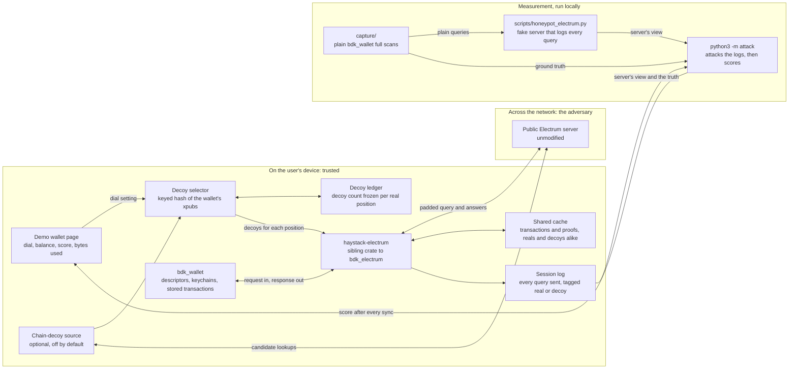
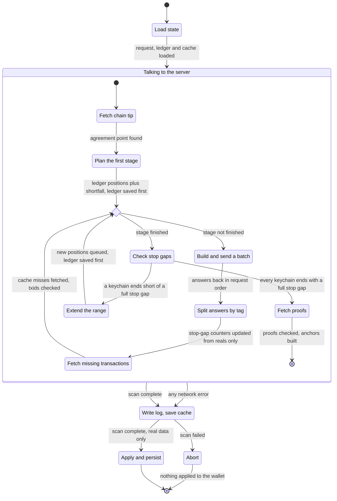
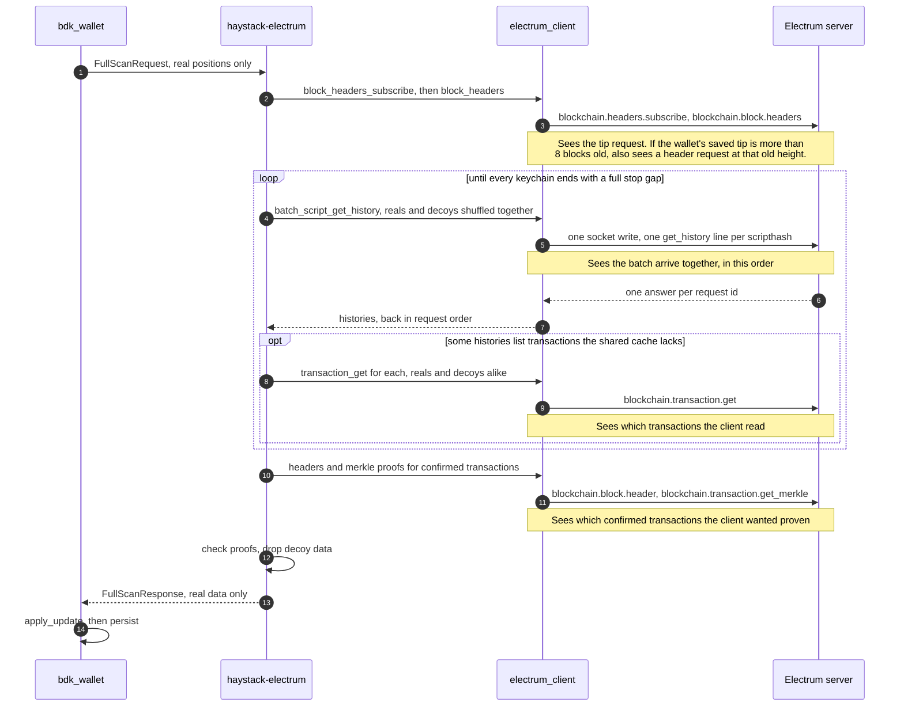

# Design

Why the padded query is built the way it is: the attacks that break the obvious approaches, the
rules the code follows to survive them, and the questions still open. What was built and when is in
`docs/04-roadmap.md`. The commands that reproduce every number are in `docs/07-walkthrough.md`.

---

## Decisions and trade-offs, in one page

Each decision below says what was chosen, why, and what it costs. The rest of this document gives the
reasoning in full; how Haystack compares with earlier work is in `docs/05-prior-art.md`.

- **Pad the query with decoys, rather than private information retrieval or block filters.** Padding
  works with the Electrum servers wallets already use, unmodified. The cost: it is obfuscation, so
  the privacy it gives is a measured score against the attacks in this repo, not a proof, and the
  bandwidth grows with the padding: about 8.4 times a plain sync at padding 10.
- **The same decoys every sync, never withdrawn.** Decoys come from a keyed hash of the wallet's
  public keys, so every sync, device and reinstall sends the same set, and the intersection attack
  (A1) finds nothing to remove. The cost: the query only grows, lowering the dial saves nothing on
  addresses already sent, and the ledger file, which records each address's decoy count, must be kept
  with the descriptor as the wallet's restore set.
- **New decoys for every new address, in the same sync.** An address first sent alone would stand out
  in the difference between two syncs (the delta corollary under A1). The cost: `padding − 1` extra
  lookups for every address the wallet ever uses.
- **Every sync is a full scan.** bdk's usual pattern syncs only addresses already handed out, which
  drops the unused ones, and dropping an address's decoys with it exposes them. The cost: the unused
  addresses and their decoys go out on every sync, 1,000 lookups at padding 10 for a never-paid
  wallet. bdk's cheaper pattern is deferred until the attacker can score it ("bdk's full-scan-then-sync
  pattern, deferred").
- **A sibling crate to `bdk_electrum`, not a fork.** `full_scan` keeps upstream's signature, so a
  `bdk_wallet` app adopts Haystack with five kinds of change (`docs/04-roadmap.md`, "Public API"),
  and the crate has no `sync` or `transaction_broadcast`, so a missed change fails to compile. The
  cost: the scan logic is a copy of upstream's to keep in step, and the regtest tests check it stays
  equivalent.
- **The wallet passes its expected unconfirmed transactions to the scan.** Only that list shows a
  payment has left the mempool when its replacement never touches the wallet, which is how
  upstream's `sync` detects it. The cost: the fifth kind of change for apps.
- **Decoys without history by default; decoys from the chain as an option, found through the sync
  server.** Made-up addresses match a new wallet exactly, since neither has any history. A restored
  wallet's funded addresses have history and no made-up decoy does, so they are exposed. Real
  addresses taken from the chain fix that against the structural attacker, but the client finds them
  by asking the same server, which can name every one from its own log. Accepted for the hackathon,
  stated wherever a score uses them; an independent lookup server is the planned fix.
- **Shuffled order, batch size counted in real addresses.** Reals and decoys are mixed within each
  stage, because sending reals first gives them away. The batch size counts real addresses' worth,
  so the 5 bdk's example passes becomes 50 lookups per write at padding 10 without the app knowing.
  The cost: the parameter means something different from upstream's.
- **One cache for real and decoy transactions, kept across restarts.** A cache filled from the
  wallet's own transactions would make a restarted client refetch only the decoys'. The cost: decoy
  transactions are stored on the device.
- **Automatic syncs on an exponential timer, never fired late.** A sync tied to a payment, a fixed
  cadence, or the app coming to the foreground would link the sync to the user. The cost: the balance
  is 30 minutes old on average at the default mean; a manual sync is available, and its timing is
  visible to the server.
- **Certificates trusted on first use and pinned, through OpenSSL.** Most public Electrum servers are
  self-signed, and 7 of 37 surveyed use old version 1 certificates, which rustls can't verify. The
  cost: the demo links the system OpenSSL.
- **The score is precision in bits, with the funded addresses' score beside it.** Plain Electrum
  reads 0.00 by definition, and no attack can make the number look better without guessing right
  (`docs/03-metric.md`). The second number exists because the headline averages over unused
  addresses and can hide a restored wallet's exposed funds. The cost: the score only covers the
  attacks someone wrote.
- **The structural attacker learns from other wallets' syncs on a local chain.** That gives it real
  server answers and the client's own fingerprint to learn from. The cost: the other wallets'
  histories are assumed, not measured, and the training set must be regenerated whenever the
  client's source changes.
- **GPL-3.0.** Derived work stays open. The cost: an app that ships Haystack must be GPL-compatible,
  while `bdk_wallet` and `bdk_electrum` are MIT or Apache-2.0.

---

## The shape of the thing

```
                  ┌────────────────────────────────────────────┐
  descriptor ───► │ derive real scripthash set R               │
  (xpub)          │   bdk_wallet: start_full_scan()            │
                  └───────────────┬────────────────────────────┘
                                  │
                  ┌───────────────▼────────────────────────────┐
  chain decoys ─► │ decoy selector (deterministic, append-only)│
  (optional)      │   key = f(account xpubs), NOT system RNG   │
                  └───────────────┬────────────────────────────┘
                                  │  Q = R ∪ D,  |Q| = padding × |R|
                  ┌───────────────▼────────────────────────────┐
                  │ query scheduler: shuffle, batching, timing │
                  └───────────────┬────────────────────────────┘
                                  │
                            Electrum server
                                  │  answers for all of Q
                  ┌───────────────▼────────────────────────────┐
                  │ local filter: discard D, apply R to wallet │
                  └────────────────────────────────────────────┘
```

The server does the same work it always did. The wallet throws most of the answers away. The cost is
bandwidth; the product is the adversary's uncertainty. "The system in diagrams", further down,
redraws this in detail.

---

## Terms this document uses

- A **script pubkey** is the locking script in a transaction output, and an address is one way of
  writing it down. bdk's type for it is `ScriptBuf`, and bdk's function names shorten it to "spk".
- A **scripthash** is `sha256(script pubkey)` with its bytes reversed. It is what an Electrum server
  is asked about. It is public and unkeyed, so it identifies an address as well as the address itself
  does (`docs/00-problem.md` §1).
- A **descriptor** is a string that says how to derive every address of a wallet from its public
  key. The demo wallet's receive descriptor in `tests/fixtures/bdk-capture-truth.json` is
  `wpkh([bd0f62bc/84'/0'/0']xpub6DHE…/0/*)`, where the xpub is the extended public key that all its
  addresses are derived from.
- A **keychain** is one derivation branch of a descriptor wallet. The external keychain (`/0/*`)
  holds receive addresses, and the internal keychain (`/1/*`) holds change addresses.
- A **position** is a keychain plus an index, such as "external, index 7". Each position has exactly
  one real script pubkey.
- The **stop gap**, also called the gap limit, is how many unused positions in a row a scan accepts
  before it decides the keychain holds nothing more. `capture/` and the demo use 50, so a wallet that
  has never been paid queries 50 + 50 = 100 scripthashes per scan.
- A **full scan** walks each keychain from index 0 until the stop gap. A **sync**, in bdk's sense,
  queries only the positions the wallet has already revealed, meaning handed out or seen used.
- A **round** is one sync session on one connection. The attack harness treats each connection as
  one round.
- A **decoy** is a scripthash the wallet does not own and queries only to hide the real ones. `R` is
  the set of real scripthashes, `D` is the set of decoys, and `Q = R ∪ D` is what gets sent.
- **Padding** is `|Q| / |R|`, and it is the user's dial. Padding 10 on the 100-scripthash demo wallet
  means 900 decoys and 1,000 queries per round.
- A **batch** is the group of requests the client writes to the socket in one go before it waits for
  the answers. `capture/` and bdk's example use batches of 5.
- The **ledger** is Haystack's record of how many decoys each position was given, frozen the first
  time the position is queried (`haystack-electrum/src/ledger.rs`).
- An **anchor** is bdk's record that a transaction is confirmed in a particular block. The client
  creates one only after checking a **merkle proof**, a short list of hashes that proves the
  transaction is included in that block.
- The **Update** is what `wallet.apply_update()` consumes: new transactions, their anchors, the new
  chain tip, and the last used index on each keychain. A `FullScanResponse` converts into one.

---

## A note on adversary strength

A decoy scheme can beat a weak adversary and still lose completely to a slightly stronger one, so
the attack tool doesn't report a single score — it reports a few, one per level of adversary. "How
strong" an adversary is comes down to one question: **what does it know?** Each level below knows
everything the one before it knows, plus one more thing:

- **Sees one sync, and nothing else.** It has no way to tell a real address from a decoy just by
  looking at it — every query set looks equally plausible.
- **Add: many syncs from the same wallet.** It can now compare rounds and watch for addresses that
  keep showing up across all of them. This is the intersection attack, A1 below, and it's where
  naive decoy schemes die — see `docs/00-problem.md` §6.
- **Add: knowledge of what a real wallet's address set looks like.** One script type, believable
  history counts, a believable used/unused ratio. This lets it rank addresses by how real they look,
  even within a single round, without needing repetition at all. This is the structural attack, A2
  below.
- **Add: on-chain clustering.** It can check whether addresses in the query were ever spent
  together, or chain together as change. Not built; it is on the post-hackathon list in
  `docs/04-roadmap.md`.
- *(Out of scope: an adversary that watches many servers and many users at once, or the network
  itself — see `docs/01-threat-model.md`'s out-of-scope list.)*

The goal: solve the single-round and multi-round cases completely, aim to survive the structural
case (that's the real design target), and report the on-chain case honestly even though it's
expected to look worse. A scheme that only survives the single-round case is theatre — no real
wallet syncs just once.

The code gives the first three levels short names — `T0`, `T1`, `T2` in `attack/scoring.py` —
because a function needs a parameter value, not because the idea needs a code. `T3` (the on-chain
level) isn't implemented. A reported score is only meaningful alongside the level it was measured
against; see `docs/03-metric.md`.

---

## The three attacks that matter

### A1 — Intersection across rounds

Real addresses recur every round, fresh decoys do not, so intersecting query sets recovers `R` exactly
in about three rounds at any padding factor (`docs/00-problem.md` §6, `tests/test_regression.py`).

Mechanically, the adversary tracks each scripthash across rounds rather than judging a query as a
whole (`analyse()` in `attack/a1_many_rounds.py`). A scripthash starts unseen, then is watched —
queried in every round since it first appeared. It leaves "watched" exactly two ways, and both
expose it:

- **It goes missing from a later round.** A wallet never stops watching its own addresses, so
  anything that vanishes must be a decoy. This is the intersection attack above.
- **It goes from no history to some, while watched.** A payment landed on it. No decoy source can
  reproduce that rise — a random hash is never paid, and a chain-sourced decoy already had whatever
  history it started with — so the address is exposed with certainty the moment it activates. **This
  is a separate exposure mechanism from vanishing, and append-only decoys do nothing to stop it.** It
  is accepted as a stated limitation. No decoy source fixes it short of decoys that are paid on the
  wallet's own schedule (`docs/07-walkthrough.md`, case 7).

**Mitigation: the decoy set is a deterministic function of the wallet's xpubs, and append-only.**

- Deterministic, so repeated queries are byte-identical and intersection yields nothing. Concretely,
  decoy `j` of a given position is `HMAC-SHA256(key, keychain ‖ index ‖ j)` — a keyed hash, so the
  same key always reproduces the same decoys.
- Derived from the wallet's own public keys rather than the system RNG. The key is a tagged SHA-256
  (tag `haystack/decoy-key/v1`) of the wallet's account xpubs, each in its 78-byte BIP32 encoding,
  sorted and deduplicated (`haystack-electrum/src/key.rs`). Every device watching the wallet, and
  every reinstall, arrives at the same key without being told it, and two wallets with different
  xpubs get unrelated decoys. The input is the xpub bytes, not the descriptor string, because one
  wallet's descriptor can be written more than one way (hardened steps as `84'` or `84h`). A
  different key changes every decoy at once, which the intersection attack reads as every decoy
  being withdrawn. For the same reason the ledger stores a fingerprint of the key and refuses to be
  used with a different one.
- Append-only, because the real set grows as addresses get revealed, and any withdrawal of a decoy
  creates an intersection signal. A position's decoy count is fixed the first time it is queried and
  never changes afterward, so moving the padding dial later only affects positions queried after the
  change. The count is recorded before the decoys are sent, not after — a crash in between could
  otherwise hand the same position a different decoy set next time, which withdraws the first one.
- A decoy that can't be re-derived from the key, such as one taken from the chain, is stored in the
  ledger as a script. Asking the chain again could pick a different address, which is a withdrawal.

**The delta corollary.** Intersection over rounds `1..t` cannot catch an address first queried at
round `t`. But the adversary can diff consecutive rounds and attack the *increment* directly. A
newly revealed real address is hidden only by decoys added in the same increment. So:

> **Every increment needs its own padding ratio.** Revealing one new address must add roughly
> `padding − 1` new decoys alongside it, in the same round.

This is the single most important structural constraint in the design and it is easy to miss.
`tests/test_a1.py` checks both sides: an increment padded this way stays at the chance rate, and one
added without decoys is exposed.

### A2 — Structural distinguishability

A real wallet's address set has shape. Decoys sampled carelessly do not, and an adversary who knows
what that shape looks like can separate them without needing repetition at all:

| Property | Real set | Careless decoys |
|---|---|---|
| Derivation | sequential from one xpub; used indices cluster low with small gaps | unrelated |
| Script type | uniform (all P2WPKH, or all P2TR) | mixed |
| History depth | mostly 0, some 1–5, occasional heavy | whatever the sample had |
| Ratio used:unused | governed by the gap limit | arbitrary |

If decoys are separable on shape, a padding factor of 10 delivers close to 1. **The padding factor
is an upper bound on privacy, not a measurement of it** — which is exactly why the attack tool, not
the padding knob, is the real deliverable.

**Measured, not just argued.** `tests/test_a2.py` runs the structural classifier
(`attack/a2_structural.py`) against decoy designs already immune to A1 — deterministic and fixed — at
padding 10, where random guessing reads 10%. Careless chain-sourced decoys stay at 10% against A1 but
rise above 60% against the classifier. Decoy wallets of the same shape as the real one stay below
20%. The data is synthetic, using assumed feature distributions from `tests/synthetic.py`, so it
tests the attack rather than Haystack.

**Mitigation status.** The server never sees derivation indices, so only three properties matter:
history counts, script types, and on-chain links between decoys.

- For positions with no history when first queried, HMAC-direct decoys ("Where decoys come from"
  below) match reals on everything the server observes: script type, zero history, and order. That
  covers a new wallet, including the never-paid demo wallet.
- For positions that already have history when first queried, such as a restored wallet, it stays
  open. Used reals have history and no HMAC decoy does, so the funded addresses stand out
  (`docs/07-walkthrough.md`, case 6). Chain-sourced decoys fix that against the structural attack
  (case 8), but they are found through the sync server, which can name every one of them from its
  own log ("Where the chain-sourced pool comes from" below).
- On-chain links between decoys aren't matched, because no attack reads them yet.

The structural attack runs on real sessions: it is trained on labelled sessions of 12 other paid
wallets on the regtest chain (`regtest/src/bin/sessions.rs`), and `python3 -m attack curve` scores
each of the 13 wallets in turn with a model fit on the other 12.

### A3 — Timing and behavioural correlation

- Wallets typically sync immediately after receiving a payment. A sync that closely precedes or
  follows a mempool arrival for a queried address is a strong signal.
- Upstream sends the query in derivation order, receive keychain first (`docs/00-problem.md` §4).
  Order alone can separate real from decoy: a structural model that also weighs position in the
  query reads above 50% precision on an otherwise well-shaped decoy set sent reals-first, against
  below 20% when the same set is shuffled, where chance is 10% (both synthetic, `tests/test_a2.py`).
- Repeated syncs at a fixed cadence identify the wallet across IP changes.

**Mitigation status.** Order and batching are built: each stage's reals and decoys are shuffled
together and cut into batches of `batch_size × padding` scripts (`haystack-electrum/src/client.rs`),
and a test requires two scans to place the reals differently. Timing is handled by the automatic-sync
timer in "Sync scheduling" below. On real regtest sessions with history hidden, a structural model
trained on order and batching alone stays within about 2.5 points of chance. Timing hasn't been
measured, because no attack reads it yet. Batch boundaries, the pauses between them, and whether an
extension stage happens at all are visible to the server and not yet modeled.

---

## Where decoys come from

The right decoy source depends on one fact about the real position a decoy covers: whether that
real address already has transaction history the first time it is queried. A decoy has to match the
real address on what the server can see, and history is the fact that differs most. So Haystack uses
two sources, one for each case.

### The two sources

- **Positions with no history when first queried use HMAC-direct decoys**
  (`haystack-electrum/src/decoy.rs`). This covers a new wallet's whole address set, including the
  demo wallet's, and any position revealed later. Decoy `j` of a position is a script of the same
  type as the real script there, filled from `HMAC-SHA256(key, keychain ‖ index ‖ j)`. For P2WPKH
  that is `OP_0` followed by the first 20 HMAC bytes. The key is the decoy key from the A1
  mitigation above. The real address has zero history and so does every decoy, so the server has
  nothing to separate them on. There is no pool to fetch, store or subtract.
- **Chain-sourced decoys cover positions that may have history when first queried. They are off by
  default** (`haystack-electrum/src/chain.rs`, `HaystackElectrumClient::with_chain_decoys`). The
  main example is a restored or imported wallet. These decoys are real addresses taken from past
  blocks, so they have real history. The client learns this wallet's history only from the server's
  answers, which come after the first padded query has already gone out. So it can't match decoys to
  the wallet's own funded positions. Instead a fixed share of every new position's decoys comes from
  the chain, rounded per position by a keyed draw. Script type is matched to the wallet's, because the
  descriptor states it before the first query. History can't be matched; it is whatever the candidate
  has, within 1 to 20 transactions. Each chosen script is stored in the ledger (`haystack-ledger/2`).

Grouping chain decoys the way real wallets appear on chain — for example, taking the inputs of one
multi-input transaction as one group — is deferred to after the hackathon, together with the
on-chain clustering attack it would be measured against. Taking real clusters rather than generating
them would mean there is no generator whose statistics could become a fingerprint.

Mempool-sourced addresses were considered and not used. A mempool sample skews toward
exactly-one-recent-transaction and mixed script types, and the Electrum protocol has no call that
lists the mempool, so it would need another source too.

### Rules and gotchas to preserve

- **A decoy is sent as a script, not as a bare scripthash.** `batch_script_get_history` takes
  scripts and hashes them itself (`electrum-client` 0.24.1, `types.rs:109`). The server receives a
  32-byte scripthash either way. Using real scripts keeps reals and decoys on one code path, and the
  session log records the script type for the structural attack.
- **Only the real script's type is read, never its hash.** So a decoy reveals nothing about the
  address it covers.
- **Twenty HMAC bytes are enough.** The chance that a P2WPKH decoy hits an address anyone has used is
  about (used addresses) ÷ 2¹⁶⁰. With 10⁹ used addresses, that is 10⁹ ÷ 1.46×10⁴⁸ ≈ 7×10⁻⁴⁰.
- **Random-hash decoys only work against real addresses with no history.** Once some reals in `Q`
  have history and no decoy does, the used reals stand out. In the restored-wallet example of
  `tests/test_metrics.py` (133 reals, 8 funded, padding 10), all 8 funded reals are exposed: 100%
  precision among addresses with history. So HMAC-direct must never be the only source for a wallet
  that has history.
- **Chain-sourced decoys are wrong for positions with no history.** The same logic runs the other
  way. Chain addresses have history where the real one doesn't. Careless chain-sourced decoys read
  above 60% precision against the structural attack in `tests/test_a2.py`.
- **A pool every user shares can be subtracted.** If the adversary knows the whole pool, then every
  queried scripthash outside it is real: the attacker's precision is 100%, which is 0.00 bits. The
  pool must therefore be per-wallet, or be drawn from a set that the wallet's own used addresses are
  also part of, such as all addresses on chain.
- **Never check a candidate on the sync server before using it.** A candidate that is queried once
  and then rejected vanishes, which is exactly the withdrawal signal the intersection attack reads.
  *Broken on purpose by the chain-decoy build; see below.*
- **Never fetch pool material from the sync server.** If the client fetches transaction T and later
  queries a scripthash from T's outputs, the server can link the two and mark that scripthash as a
  decoy. *Broken on purpose by the chain-decoy build; see below.*

### Where the chain-sourced pool comes from

**Decided for the hackathon: the sync server, knowingly.** Chain decoys are found through the same
server the wallet syncs with, so no second server is needed. This breaks the last two rules above.
The attack that exploits it is described here and deliberately not built. The harness ignores the
lookups, so every chain-decoy score in this repo is what an attacker gets *if it never reads its own
log*. A second, independent lookup server is on the post-hackathon list (`docs/04-roadmap.md`).

*The attack, not built.* The server lists every scripthash whose history it was asked for before
the round in which that scripthash was first queried, and crosses those off. All the chain decoys
are on that list, plus the candidates that were rejected. No real address is on it, because the
client never looks up its own. A new connection doesn't help: the overlap between "outputs of
transactions fetched from nowhere" and "addresses later queried" matches two sessions by content
alone. After crossing them off, the scripthashes with history that are left are exactly the funded
reals. The session log records these lookups as `probes`, and `docs/07-walkthrough.md`, case 8,
shows that every chain decoy appears in them before it appears in the query.

*What regtest can and can't show.* On regtest, the candidates are other regtest wallets' addresses
and the node's own. Their histories come from the same assumed tables as the real wallets
(`regtest/src/population.rs`), so the structural attack can't tell them apart on history by
construction. Chain-decoy rows measured there are optimistic for that reason too. On mainnet the
candidates would follow the chain's real mix, exchanges included.

---

## haystack-electrum: the padded sync client

`BdkElectrumClient::full_scan` and `sync` are a closed box. They take a request built from the
wallet's keychains, decide which scripthashes to query, do the network I/O, and return a finished
update. Nothing in that call lets decoys be added before sending and removed before the update is
built, so padding has to live inside the box.

### How it fits into bdk

- **A sibling crate, `haystack-electrum`, not a fork of `bdk_electrum`.** Everything
  `BdkElectrumClient` is made of is public: the `electrum_client::ElectrumApi` trait, and
  `bdk_core::spk_client`'s request, response, `TxUpdate` and `CheckPoint` types. `bdk_wallet::Update`
  converts from a `FullScanResponse` (`src/wallet/mod.rs:118,130,140`), and `apply_update` accepts it
  (`:2353`). So a reimplemented `full_scan` with decoys added plugs into `wallet.apply_update()`
  unchanged, with no fork of `bdk_electrum` and no change to `bdk_wallet`. The five kinds of change
  an app makes to adopt it are listed in `docs/04-roadmap.md`, Week 2, "Public API".
- **Every script carries a tag saying whether it is real or a decoy.** In the code these are
  `Tag::Real(position)` and `Tag::Decoy(position, j, from_chain)` (`haystack-electrum/src/client.rs`).
  The tag travels with its script through the shuffle and the batching. Each batch is one
  `batch_script_get_history` call, and the answers are matched back to the tags in request order;
  diagram 3 explains why that order holds. Only real answers feed the stop-gap, transaction and
  anchor bookkeeping copied from upstream. Decoy answers take a separate path.
- **A full scan still detects mempool evictions, given the wallet's expectations**
  (`full_scan_expecting`). Upstream's `sync` request lists, for each address, the unconfirmed
  transactions the wallet counts, and bdk_electrum marks one evicted when the server's history no
  longer has it (0.23.2 `populate_with_spks`). A full-scan request carries no such list, so a
  payment that leaves the mempool, double-spent to an address the wallet never asks about, would
  stay in the balance forever. `full_scan_expecting` takes the list from
  `wallet.start_sync_with_revealed_spks()` and applies upstream's rule to the real addresses'
  answers only. It is local bookkeeping: the scripts sent are the same with or without it, which
  `expectations_change_nothing_on_the_wire` checks. `regtest/tests/eviction.rs` double-spends an
  unconfirmed payment and requires Haystack to end with the balance upstream's `sync` gives.

### Rules and gotchas to preserve

- **A decoy is sent exactly when its real position is sent, so every sync is a full scan.** bdk's
  usual pattern is one full scan, then syncs of revealed positions only
  (`start_sync_with_revealed_spks`, `src/wallet/mod.rs:2595`). A full scan reveals positions only up
  to the last used index (`reveal_to_target_multi`, line 2363), so the unused tail drops out of every
  sync and returns at the next full scan. For the never-paid demo wallet, that is 100 scripthashes in
  the full scan and 1 in the next sync. Both naive ways of handling decoys then fail:
  - If the decoys stay while the tail leaves, the scripthashes that vanish are exactly the wallet's
    next receive and change addresses (`docs/00-problem.md` §5).
  - If decoys leave on a schedule of their own, the intersection attack exposes each one that leaves.

  Attaching decoys to positions and making every sync a full scan means nothing ever leaves the
  query, and the harness rule "anything that goes missing is a decoy" (`attack/a1_many_rounds.py`)
  stays sound. So the crate has no `sync` method at all, and an app that calls one fails to compile
  instead of silently sending an unpadded query. The cost is the tail on every sync: 100 positions,
  which is 1,000 scripthashes at padding 10 with a stop gap of 50, even for a wallet that has never
  been paid.
- **A decoy with history gets the same follow-up calls as a real one:** the transaction fetch and the
  merkle proof. A scripthash that has history but whose transactions are never read doesn't look like
  an owned address. So padding's bandwidth grows with how much history the decoys have, not only with
  how many there are, and the bandwidth curve (`python3 -m attack curve`) includes that cost. Checked
  by `a_decoy_with_history_is_fetched_like_a_real_and_then_dropped`
  (`haystack-electrum/tests/full_scan.rs`).
- **Decoy transaction data never reaches the `Update`.** `apply_update` would insert it into the
  wallet's `TxGraph`, where it would sit unindexed and grow on every sync. That is storage bloat, not
  a balance bug. The same test checks that the response holds no decoy transaction.
- **The transaction and proof caches treat reals and decoys the same way, including after a
  restart.** The client fetches only transactions missing from its cache (0.23.2
  `bdk_electrum_client.rs:71`). bdk's example fills the cache from the wallet's stored transactions
  (`~/bdk_wallet/examples/electrum.rs:52`), which are real ones only. After a restart the client would
  then re-fetch every decoy transaction and no real one. For example, if 8 reals and 90 decoys have
  history, the server sees re-fetches for the 90 and none for the 8, which are exactly the used
  reals. So `haystack-electrum` uses one cache for both (`fetch_txs`), filled only by its own
  fetches, and has no `populate_tx_cache`; an app copied from bdk's example fails to compile instead
  of recreating this leak.
- **The cache is saved across restarts** (`haystack-electrum/src/cache_file.rs`, format
  `haystack-cache/1`). After each scan, finished or not, and after the session log is written, the
  client saves every transaction and merkle proof it fetched (`with_cache_store`); a restarted client
  loads them back (`with_saved_cache`). A test restarts with it and requires zero transaction
  fetches, and restarts without it and requires reals and decoys to be refetched together. Block
  headers are not saved. They are cached by height, so after a reorganisation a saved header would
  send a proof lookup to a block no longer on the chain. Proofs are saved under their block's hash,
  so a replaced block misses the cache and is proven again. The regtest gate carries the cache
  through its one-block reorganisation and still matches upstream exactly.
- **Every fetched transaction's id is checked.** A transaction whose computed txid differs from the
  one requested is rejected, so a hostile server can't answer one request with a different
  transaction. Published 0.23.2 doesn't check this. The check was ported by hand from bdk's unreleased
  master (`fetch_txs`).

### bdk's full-scan-then-sync pattern, deferred

Syncing only the revealed positions between full scans would save the tail's bandwidth: a tail
position and its decoys would leave together at each sync and return at the next full scan. It is
on the post-hackathon list, not built, because the harness has to change first. Its "missing means
decoy" rule is wrong for that pattern: a tail that leaves and returns would be scored as if it had
been withdrawn, while an attacker who watched it leave and return would correctly pick out every
tail position as real. The harness must first group scripthashes by their whole pattern of presence
across rounds, not only by the round they first appeared.

### Which upstream version to copy

- **The crate targets `bdk_wallet` 2.1.0 from crates.io.** It uses the same set
  the workspace's `Cargo.lock` resolves: `bdk_electrum` 0.23.2, `bdk_chain` 0.23.3, `bdk_core` 0.6.3 and
  `electrum-client` 0.24.1. That toolchain produced the fixtures in `tests/fixtures/`. The local
  `~/bdk_wallet` is a personal fork at 3.1.0 that exists only in that checkout. It is read, never
  built against.
- **The crate must resolve the same `bdk_core` minor version, 0.6, as `bdk_wallet`.** Rust treats one
  type from two versions of a crate as two different types. A response built against another
  `bdk_core` wouldn't convert into `bdk_wallet`'s `Update`, and the code wouldn't compile.

---

## The system in diagrams

Three diagrams show how the parts fit together:

1. The whole system on one page: every part, and which way data moves between them.
2. One sync inside `haystack-electrum`: the crate's work, step by step.
3. One sync on the wire: every message, and what the server can record from it.

A fourth section, without a diagram, covers what each user action does to the query.

### 1. The whole system on one page



This picture answers where each part of Haystack runs, which parts the user has to trust, and which
way each piece of data travels. Every part in it exists in this repo.

The product path runs in five steps:

1. The user sets the dial in the demo page, and the dial sets the padding.
2. `bdk_wallet` builds a `FullScanRequest` that lists its real positions, exactly as it does today.
   It does not know Haystack exists.
3. The decoy selector looks up each position in the decoy ledger. A position the server has already
   seen keeps the decoys it had. A new position gets `padding − 1` new decoys, derived by a keyed
   hash of the wallet's xpubs, with an optional share taken from the chain (A1's mitigation above).
4. `haystack-electrum` sends each real scripthash together with its decoys, shuffled, and collects
   every answer.
5. It keeps only the real answers and hands `bdk_wallet` a `FullScanResponse`, which
   `wallet.apply_update()` accepts unchanged.

The server is the only part on the far side of the trust boundary. It receives every scripthash in
`Q` and answers all of them. The design assumes it answers honestly. A lying server is out of scope
(`docs/01-threat-model.md`), because it can already show any client a false balance. The chain-decoy
source talks to the same server, which is the weakness described under "Where the chain-sourced pool
comes from".

The measurement path has two sources of ground truth. For plain syncs, `capture/` runs stock
`bdk_wallet` and records what the wallet itself sent, and the honeypot records what arrived. For
padded syncs, the client's own session log (`haystack-electrum/src/session.rs`) is the ground
truth. The session log exists because the honeypot can't measure decoys with history: it answers
"nothing found" to every query, while the structural attack needs the server's real answers, each
scripthash's transaction count and script type (`Fact` in `attack/observe.py`). The client receives
exactly those answers and also knows which entries were real, so it writes both inputs of the
harness into one file. The honeypot then becomes an independent check that the session log matches
what a server really received. `docs/07-walkthrough.md` has the commands for each path.

Worked example: the demo wallet has never been paid, so a full scan covers positions 0 to 49 on both
keychains, which is 100 real scripthashes. At padding 10 each position carries 9 decoys, so each sync
sends 1,000 scripthashes and throws 900 of the answers away. Plain Electrum would send the 100. The
correctness gate (`regtest/tests/gate.rs`) requires the wallet's balance and transactions to come
out identical either way.

### 2. One sync inside haystack-electrum



This picture answers what the crate does and in what order, which steps are copied unchanged from
`bdk_electrum` 0.23.2, and where the rules in "haystack-electrum" turn into code. Every sync is a
full scan, so a sync and a full scan are the same operation here.

- **Load state.** The crate reads the wallet's `FullScanRequest`, which always comes from
  `wallet.start_full_scan()`, plus the decoy ledger and the shared cache.
- **Talking to the server** is the box around the whole scan. Most steps inside it send something
  over the network, so a network error anywhere inside it ends the scan.
- **Fetch chain tip.** This step is copied from `fetch_tip_and_latest_blocks` (0.23.2 line 608). It
  asks for the server's tip and the 8 newest block headers. Then it walks back through the wallet's
  saved blocks to the agreement point, which is the newest block whose hash the wallet and the server
  agree on. Anything the wallet saved above that point was replaced by a reorganisation of the chain,
  and it is rebuilt from the server's blocks.
- **Plan the first stage** (`haystack-electrum/src/planner.rs`). A stage is a set of positions whose
  queries don't depend on any answer still outstanding, so they can all go out together. The first
  stage holds every position the ledger already froze, extended on each keychain to the stop gap as
  if none of them had new history. A position new to the ledger gets `padding − 1` decoys at the
  current dial, and the ledger is saved before any batch carrying it leaves the device.
- **Build and send a batch.** The whole stage's reals and decoys are shuffled together and cut into
  batches of `batch_size × padding` scripts, each sent in one write. Batches are deliberately not
  aligned to positions. If every batch held exactly 5 positions' worth of reals and decoys, the
  server would know each 50-script batch contains exactly 5 reals. On the demo wallet's
  1,000-scripthash round, that shrinks the attacker's candidate space from "choose 100 of 1,000",
  `log2(C(1000,100)) ≈ 464` bits, to "choose 5 from each of 20 fixed batches of 50",
  `20 × log2(C(50,5)) ≈ 420` bits, handing over about 44 bits for no benefit.
- **Split answers by tag.** Answer i belongs to request i, and diagram 3 explains why that holds.
  Real answers update their keychain's stop-gap counter and last used index. Decoy answers go to the
  decoy side and never reach the response.
- **Fetch missing transactions.** Reals and decoys follow the same rule here: fetch a transaction only
  if the shared cache lacks it. A transaction whose computed txid differs from the requested one is
  rejected.
- **Check stop gaps.** The crate counts unused positions in a row at the end of each keychain, as
  upstream does. A keychain's **shortfall** is how many more positions it needs to end with
  `stop_gap` unused ones in a row. The shortfall is known before any answer arrives, and answers can
  only raise it: a used position resets the unused run and demands more positions, and an unused one
  never demands fewer. So every position in the current shortfall will be queried whatever the
  answers say, and they all go out as one stage. Another stage is needed only when an answer shows a
  used position inside the last `stop_gap`, so a round takes at most one stage more than the number
  of used positions it finds. The positions queried are exactly those upstream's sequential walk
  reaches; `planner.rs` checks this against a reference walk on 2,000 random histories. The only
  difference is upstream's extra overshoot: up to `batch_size − 1` positions past the stop point,
  sent and then ignored.
- **Fetch proofs.** This step is copied from `batch_fetch_anchors` (0.23.2 line 475), but it runs for
  every confirmed transaction, real or decoy. Each merkle proof is checked against its block header
  before the anchor is kept.
- **Write log, save cache.** The client writes the round to the session log, including a failed
  round, so a round that reached the server is never hidden. Then it saves the shared cache.
- **Apply and persist.** The crate builds the transaction update, the last used indices and the
  chain update from real data only. The app then runs `wallet.apply_update()` and `wallet.persist()`.
- **Abort.** The sync ends with nothing applied to the wallet. The ledger keeps whatever it already
  saved, so the retry sends the same positions with the same decoys.

Worked example, the demo wallet at padding 10:

- **First sync.** The ledger starts empty, so each keychain's shortfall is the full 50. Both
  keychains' positions 0 to 49 go out in a single stage, and the crate saves 100 ledger entries of 9
  decoys each before it sends anything. All 1,000 scripthashes are shuffled together across 20
  batches of 50. All 1,000 answers come back empty, because the wallet has never been paid, so both
  keychains end with 50 unused positions and scanning stops. No transaction is confirmed, so there
  are no proofs to fetch.
- **Second sync, with nothing changed.** The ledger already holds all 100 positions, which already
  end in 50 unused ones on each keychain. So the round is one stage of the same 1,000 scripthashes,
  with their frozen decoys, in a fresh shuffle.
- **Third sync, after a payment to external index 3.** The first stage's answers show index 3 now has
  history, so the last used index on the external keychain becomes 3. That keychain's unused run
  drops to 46 positions, indices 4 to 49 — short of the 50-position stop gap by 4. So the crate runs
  one more stage for positions 50 to 53, with 4 × 9 = 36 new decoys. Upstream would scan the same
  range: 0.23.2 counts unused positions from index 0 and stops at the fiftieth in a row, which is
  index 53. `planner.rs`'s `payment_to_index_3_extends_to_53` checks this.

### 3. One sync on the wire



This picture answers what a hostile server can record during one sync. Every attack in this repo
works from some part of this list, so the picture is also a map of what the harness models and what
it doesn't.

Two facts from `electrum-client` 0.24.1 make the batching safe, and also make it visible:

- `batch_call` (`raw_client.rs:784–839`) gives each request a fresh, increasing id, joins the requests
  with newlines, and sends them in one write. It collects the answers in a map keyed by id and returns
  them in id order. The ids were handed out in request order, so answer i belongs to request i. That
  is what makes the tag split in diagram 2 safe.
- The single write shows on the server's side. In `tests/fixtures/bdk-honeypot-log.json`, the first
  five scripthash requests on connection 1 arrive between t = 0.9818 s and 0.9819 s, and the next five
  arrive at t = 1.0250 s. So the requests in a batch arrive within the log's 0.1 ms resolution, and
  the batches are about 43 ms apart. The server can see where each batch starts and ends, even though
  every request is its own line.

What the server can record, and whether the harness models it yet:

- **The set of scripthashes in each round** is modeled. The intersection attack works on it.
- **The order within each round** is modeled. The structural model scores which tenth of the query
  each scripthash arrived in — the numbers are under A3 above.
- **The server's own facts about each scripthash**, its transaction count and script type, are
  modeled, but only when the log carries them. The honeypot's log doesn't.
- **Batch boundaries and the pauses between batches** are not modeled.
- **Which transactions and proofs the client fetches** are not modeled. The rules that reals and
  decoys are fetched and cached the same way exist so that this channel carries nothing, but no
  attack checks that yet.
- **The header request at an old height** is not modeled. When the wallet's saved tip is more than 8
  blocks behind, `fetch_tip_and_latest_blocks` asks for the header at the wallet's own last-sync
  height (0.23.2 line 645). That height can link two syncs made from different IP addresses.
- **When syncs happen, and how often,** is not modeled.

The last four are gaps in the attack suite, not in the design. Until attacks cover them, each score
overstates the privacy that a real server would leave the user.

### 4. What each user action does to the query

The demo page's screens are described in `demo/README.md`. This section covers only the design
consequence of each thing a user can do.

**Moving the dial applies only to positions first queried after the change.** An address's
protection is fixed by the decoys that were first queried alongside it. The attack harness grants
the attacker the number of real addresses that first appeared in each round (`knowledge()` in
`attack/scoring.py`; `docs/03-metric.md`, open question 3), so a decoy that first appears in a later
round protects nothing that came before it. Worked example, with the 100-address demo wallet:

- At padding 5 for four rounds, the round-1 cohort is 500 scripthashes holding all 100 reals, so the
  attacker's precision is 100 ÷ 500 = 20%.
- Raising the dial to 10 at round 5 and redrawing every position's decoys at the new count would add
  500 decoys first seen in round 5. The attacker knows no real address first appeared in round 5, so
  it discards all 500, and precision stays at 20% while the bandwidth doubles.
- Lowering the dial from 10 to 5 and dropping decoys to match withdraws them, and the intersection
  attack exposes every withdrawn one as a decoy. That doesn't depend on the cohort count at all.

So existing positions keep their decoys forever, and lowering the dial saves no bandwidth for them.
The ledger file is what keeps this true across a restore: without it, a restore at padding 5 after
syncs at 10 and 20 sent 670 scripthashes instead of 1,350, and the headline fell to 2.23 bits
(`docs/04-roadmap.md`, Week 4, "Restore path"). The demo's confirm dialog states the rule before a
change is applied.

**Receiving a payment** exposes the paid address with certainty — the activation attack described
under A1. Nothing in the current design prevents it.

**Handing out a new address** changes nothing on the wire. The address is already inside the tail,
so it has been queried with its decoys since the first full scan, and every sync is a full scan. New
positions appear only when a payment moves the last used index forward, as in the third sync of
diagram 2's worked example. Each new position arrives with `padding − 1` new decoys first seen in
the same round. That is the delta corollary from A1, applied automatically.

**Choosing when to sync.** A sync right after the user hears about a payment links the sync to the
payment, which is the timing attack (A3). The private default is the automatic timer in "Sync
scheduling" below. Manual sync stays available, and the page says what its timing reveals.

**A failed sync** is retried with the same positions and the same decoys, so it reveals nothing new.

**The plain copy** in the demo sends the unpadded query, which is the leak itself. So it runs only
for the two public-seed wallets, the never-paid demo wallet and the regtest wallet, against local
servers: the honeypot or regtest's `electrs`. It never runs against a public server.

---

## Sync scheduling: the automatic-sync timer

Suppose a wallet syncs right after its owner notices a payment. The sync's timing is then tied to the
payment, however well `Q` is padded. The server already knows when a payment landed on any address it
has history for. What a badly timed sync adds is confirmation that this client noticed it, and
roughly when. A fixed cadence adds a second leak: it identifies the wallet across IP changes (A3
above). This section is the timing half of A3's mitigation, built as `SyncTimer` in
`haystack-electrum/src/schedule.rs` and driven by the demo's sync loop.

### How the timer works

- **The next sync's delay is drawn the moment a sync finishes, and nothing moves it.** A payment
  landing, an address being revealed or the user opening the app can't shorten or lengthen it. If a
  sync's timing never depends on what happened in the wallet since the last one, a timing
  correlation has nothing to find, however the delay itself is distributed. The loop sleeps until
  the timer is due, runs `full_scan`, then calls `finished()`.
- **The delay is exponential, not a fixed interval with bounded jitter.** It is drawn as
  `−mean · ln(U)`, where `U` is uniform on (0, 1]. A bounded jitter has a deadline: with "every 30
  minutes, plus or minus 10", once 39 minutes have passed, a sync within the next minute is certain,
  because 40 minutes is the maximum. The adversary knows that maximum, because the threat model
  grants it the client's behaviour, cadence included. An exponential delay has no deadline. With
  mean `μ`, the chance of no sync in the next `t` minutes is `e^(−t/μ)`, however long the wait has
  already been. This property is called memorylessness. Worked example with a mean of 30 minutes:
  the chance of a sync in the next 5 minutes is `1 − e^(−5/30) = 1 − 0.846 ≈ 15.4%`. That is the same
  at the 1-minute mark, the 39-minute mark or the 5-hour mark.
- **The default mean is 30 minutes (`DEFAULT_MEAN`).** It trades bandwidth against how stale the
  balance gets. A mean of 30 minutes gives 24 × 60 ÷ 30 = 48 syncs a day on average. At Week 3's
  measured 253.5 KiB per steady-state sync (the paid regtest wallet at padding 10, with its saved
  cache), that is 48 × 253.5 = 12,168 KiB, about 11.9 MiB a day. With an exponential delay, the
  balance's age at a random moment is exponential with the same mean, so it is 30 minutes old on
  average and older than an hour e^(−60/30) ≈ 13.5% of the time. A 60-minute mean would halve the
  bandwidth, but the balance would be older than an hour e^(−1) ≈ 36.8% of the time. The demo runs
  with a 2-minute mean so automatic syncs happen while people watch, and the page says so. That is a
  presentation setting, not a recommendation.
- **A missed sync is skipped, not fired late (`SyncTimer::missed` and `skip`).** A phone freezes
  background apps while its clock keeps running, so when the app returns the timer is already past
  due. Firing then would tie the sync to the moment the user looked. Instead, a loop that wakes more
  than `LATE` (5 s) after the due time draws a fresh delay from now. Example, at a 30-minute mean:
  the app is frozen at 10:00 with a sync due at 10:12, and the user opens it at 11:00 because someone
  said they paid. Firing at 11:00:01 tells the server the user looked right after a payment landed.
  A fresh draw gives, say, 11:23. Because the delay is memoryless, the chance of a sync within 5
  minutes of the app returning is 1 − e^(−5/30) ≈ 15.4%, the same as in any 5-minute window of an
  app that was never frozen. The same rule covers a timer that comes due while a manual sync is
  running.
- **Polling, not Electrum's subscribe mechanism.** With `blockchain.scripthash.subscribe`, a client
  sends each address once and the server pushes a notification whenever that address changes. This
  is what the reference Electrum clients use. `electrum-client` 0.24.1 implements it
  (`raw_client.rs:143,733-743`), but `BdkElectrumClient` and this repo don't call it, for two reasons:
  - Subscribing still sends every scripthash in `Q` up front, in the same batch shape as a poll. It
    changes how updates arrive, not what the server learns.
  - A decoy never gets a notification, because nothing ever happens to it, while a real address gets
    one when it is paid. The follow-up-call rule in "haystack-electrum" above needs decoys to be read
    like reals. So the client would have to invent follow-up traffic for every decoy on a schedule of
    its own, which reopens the timing problem one address at a time.

### Rules to preserve

- **A manual sync never touches the automatic timer.** The user's tap on "Sync" is a separate path,
  and the screen says that its timing is exposed. Because the delay is memoryless, resetting the timer
  after a manual sync wouldn't change the odds anyway, so leaving it alone is the simplest correct
  rule.
- **A failed automatic sync is retried on a fresh draw.** A fixed retry interval would itself be a
  cadence.
- **Never sync automatically because the app came to the foreground.** That reintroduces exactly the
  correlation this section removes. An overdue background sync stays silent and scheduled.
- **The tests pin the distribution down.** `schedule.rs`'s tests check that the mean is the one
  configured, that the chance of a sync in the next 5 minutes doesn't depend on how long it has
  been, that there is no deadline, and that only a finished sync moves the timer. A bounded jitter
  of 30 ± 10 minutes, which has the same mean, would fail them.
