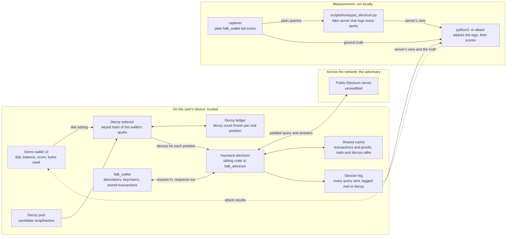
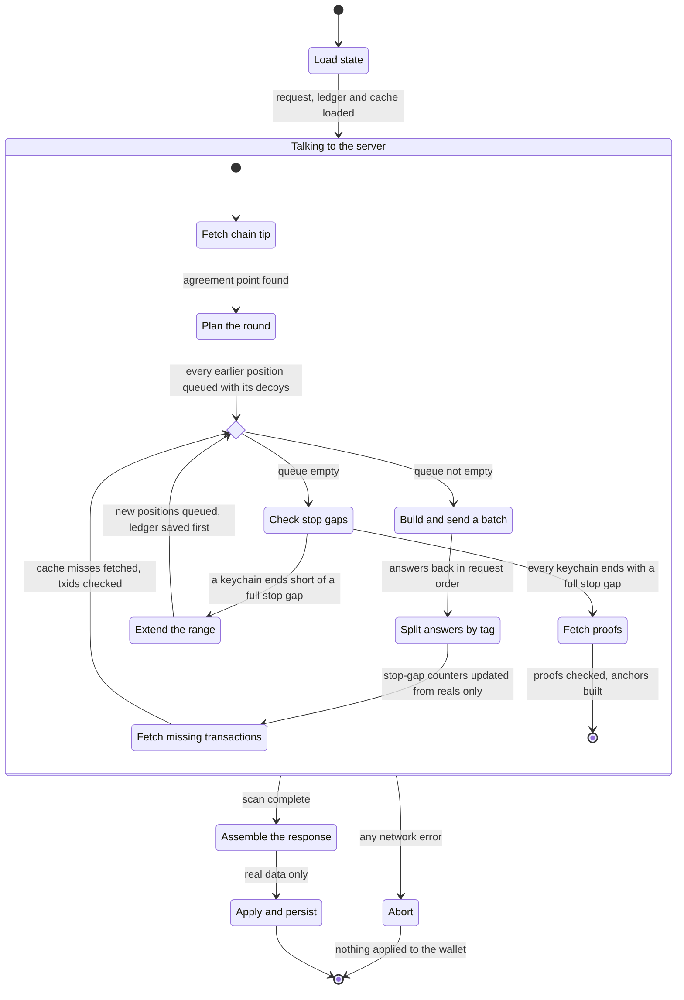
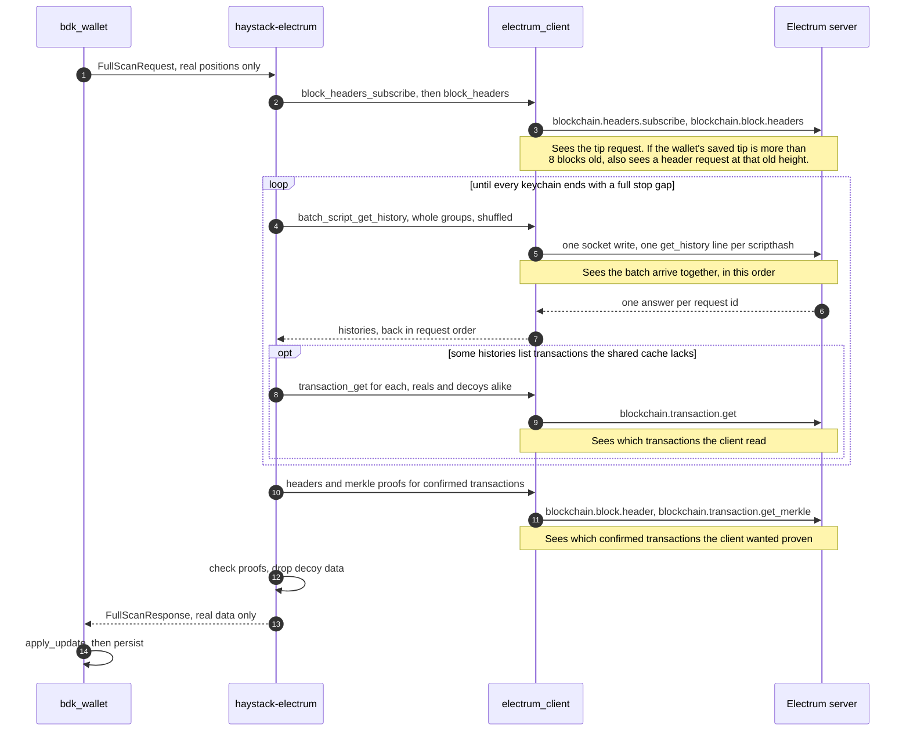

# Design

How the query gets built, the three attacks that break the obvious approaches, and the questions
still open. This is the document that should be most rewritten as implementation proceeds.

---

## The shape of the thing

```
                  ┌────────────────────────────────────────────┐
  descriptor ───► │ derive real scripthash set R               │
  (xpub)          │   bdk_wallet: reveal_addresses_to / peek   │
                  └───────────────┬────────────────────────────┘
                                  │
                  ┌───────────────▼────────────────────────────┐
  decoy pool ───► │ decoy selector (deterministic, append-only)│
  (chain-sourced) │   seed = f(account xpubs), NOT system RNG  │
                  └───────────────┬────────────────────────────┘
                                  │  Q = R ∪ D,  |Q| = padding × |R|
                  ┌───────────────▼────────────────────────────┐
                  │ query scheduler: order, batching, timing   │
                  └───────────────┬────────────────────────────┘
                                  │
                            Electrum server
                                  │  answers for all of Q
                  ┌───────────────▼────────────────────────────┐
                  │ local filter: discard D, apply R to wallet │
                  └────────────────────────────────────────────┘
```

The server does the same work it always did. The wallet throws most of the answers away. The cost is
bandwidth; the product is the adversary's uncertainty.

This sketch is the one-glance version. "The system in diagrams", further down, redraws it in detail:
every part and its status, what the user sees, one sync step by step and on the wire, and how the
attack harness turns a log of queries into a score.

---

## The three attacks that matter

### A1 — Intersection across rounds

Real addresses recur every round, fresh decoys do not, so intersecting query sets recovers `R` exactly in about three rounds at any padding factor.

Mechanically, the adversary tracks each scripthash across rounds rather than judging a query as a
whole (`analyse()` in `attack/a1_many_rounds.py`). A scripthash starts unseen, then is watched — queried in every
round since it first appeared. It leaves "watched" exactly two ways, and both expose it:

- **It goes missing from a later round.** A wallet never stops watching its own addresses, so
  anything that vanishes must be a decoy. This is the intersection attack above.
- **It goes from no history to some, while watched.** A payment landed on it. No decoy source can
  reproduce that rise — a random hash is never paid, and a chain-sourced decoy already had whatever
  history it started with — so the address is exposed with certainty the moment it activates. **This is a separate
  exposure mechanism from vanishing, and append-only decoys do nothing to stop it** — it is accepted
  as a stated limitation for this build, not solved.

**Mitigation: the decoy set is a deterministic function of the wallet's xpubs, and append-only.**

- Deterministic, so repeated queries are byte-identical and intersection yields nothing. Concretely,
  decoy `j` of a given position (a keychain and an index) is `HMAC-SHA256(key, keychain ‖ index ‖ j)`
  — a keyed hash, so the same key always reproduces the same decoys.
- Derived from the wallet's own public keys rather than the system RNG. The key
  is a tagged SHA-256 (tag `haystack/decoy-key/v1`) of the wallet's account xpubs, each in its 78-byte
  BIP32 encoding, sorted and deduplicated (`haystack-electrum/src/key.rs`). Every device watching the
  wallet, and every reinstall, arrives at the same key without being told it, and two wallets with
  different xpubs get unrelated decoys. The input is the xpub bytes, not the descriptor string,
  because one wallet's descriptor can be written more than one way (hardened steps as `84'` or `84h`).
  A different key changes every decoy at once, which the intersection attack reads as every decoy
  being withdrawn. For the same reason the ledger stores a fingerprint of the key and refuses to be
  used with a different one.
- Append-only, because the real set grows as addresses get revealed, and any withdrawal of a decoy
  creates an intersection signal. In practice, a position's decoy count is fixed the first time it is
  queried and never changes afterward, so moving the padding dial later only affects positions queried
  after the change. The count must be recorded before the decoys are sent, not after — a crash in
  between could otherwise hand the same position a different decoy set next time, which withdraws the
  first one.
- If decoys are drawn from a pool (see "Where decoys come from" below), each position must also pin
  the pool version it used. Resizing the pool would otherwise shift every hash-derived pick at once —
  a mass version of the same withdrawal signal.

**The delta corollary.** Intersection over rounds `1..t` cannot catch an address first queried at
round `t`. But the adversary can diff consecutive rounds and attack the *increment* directly. A
newly revealed real address is hidden only by decoys added in the same increment. So:

> **Every increment needs its own padding ratio.** Revealing one new address must add roughly
> `padding − 1` new decoys alongside it, in the same round.

This is the single most important structural constraint in the design and it is easy to miss.

### A2 — Structural distinguishability

A real wallet's address set has shape. Decoys sampled carelessly do not, and an adversary who knows
what that shape looks like can separate them without needing repetition at all:

| Property | Real set | Careless decoys |
|---|---|---|
| Derivation | sequential from one xpub; used indices cluster low with small gaps | unrelated |
| Script type | uniform (all P2WPKH, or all P2TR) | mixed |
| History depth | mostly 0, some 1–5, occasional heavy | whatever the sample had |
| Ratio used:unused | governed by the gap limit | arbitrary |

If decoys are separable on shape, a padding factor of 10 delivers close to 1. **The padding factor
is an upper bound on privacy, not a measurement of it** — which is exactly why the attack tool, not
the padding knob, is the real deliverable.

**Measured, not just argued.** `tests/test_a2.py` runs the structural classifier (`attack/a2_structural.py`)
against decoy designs already immune to A1 — deterministic and fixed — at padding 10, where random
guessing reads 10%. Careless chain-sourced decoys stay at 10% against A1 but rise above 60% against
the classifier. Decoy wallets of the same shape as the real one stay below 20%. The data is
synthetic, using assumed feature distributions from `tests/synthetic.py`, so it tests the attack rather
than Haystack.

**Mitigation status (measured on real sessions).** For positions with no history when
first queried, HMAC-direct decoys ("Where decoys come from" below) match reals on every property the
server observes: script type, zero history, and order. That covers a new wallet, including the demo
wallet. It stays open for positions that have history when first queried, such as a restored wallet.
There, HMAC decoys stand out, because used reals have history and no decoy does. Chain-sourced decoys
fix that against the structural attack, but they are found through the sync server, which can name
every one of them from its own log (see "Where the chain-sourced pool comes from" below). The
client can match script type up front, because the descriptor states it. History is the part it
can't know before its first query. Derivation structure is not observable to the server. Coherence
only matters through what the server does observe: history counts, script types, and on-chain links
between decoys.

The structural attack now runs on real sessions (option B, `python3 -m attack curve`). It is trained
on 12 other paid wallets on the regtest chain. Each of the 13 wallets is scored in turn by a model
fit on the other 12.

This is the hardest unsolved part of the design and where the most time should go.

### A3 — Timing and behavioural correlation

- Wallets typically sync immediately after receiving a payment. A sync that closely precedes or
  follows a mempool arrival for a queried address is a strong signal.
- The query burst is currently in derivation order (see the `.inspect()` output from
  `~/bdk_wallet/examples/electrum.rs:54`). Order alone can separate real from decoy: a structural
  model that also weighs position in the query reads above 50% precision on an otherwise
  well-shaped decoy set sent reals-first, against below 20% when the same set is shuffled, where
  chance is 10% (both synthetic, `tests/test_a2.py`).
- Repeated syncs at a fixed cadence identify the wallet across IP changes.

**Mitigation status.** Order and batching are resolved and built: each stage's reals
and decoys are shuffled together and cut into batches of `5 × padding` scripts. `full_scan`'s
`batch_size` counts real addresses' worth, so the 5 that `bdk_wallet`'s example passes gives exactly
that (`haystack-electrum/src/client.rs`), and a test requires two scans to place the reals
differently. Timing is decided and implemented as `haystack-electrum/src/schedule.rs`, detailed in
"Sync scheduling" below. Order and batching were measured against the structural attack on real
regtest sessions in Week 3: with history hidden, a model trained on them alone stays within about
2.5 points of chance. Timing hasn't been measured, because no attack reads it yet. Batch
boundaries, the pauses between them, and whether an extension stage happens at all are visible to
the server and not yet modeled.

---

## Where decoys come from

The right decoy source depends on one fact about the real position a decoy covers: whether that
real address already has transaction history the first time it is queried. A decoy has to match the
real address on what the server can see, and history is the fact that differs most. So Haystack uses
two sources, one for each case.

### What Haystack builds

- **Positions with no history when first queried use HMAC-direct decoys. Built in Week 2**
  (`haystack-electrum/src/decoy.rs`). This covers a new wallet's whole address set, including the
  demo wallet's, and any position revealed later. Decoy `j` of a position is a script of the same
  type as the real script there, filled from `HMAC-SHA256(key, keychain ‖ index ‖ j)`. For P2WPKH
  that is `OP_0` followed by the first 20 HMAC bytes. The key is the decoy key from the A1
  mitigation above. The real address has zero history and so does every decoy, so the server has
  nothing to separate them on. There is no pool to fetch, version or subtract.
- **Chain-sourced decoys, for positions that may have history when first queried. Built, off by default** (`haystack-electrum/src/chain.rs`, `HaystackElectrumClient::with_chain_decoys`).
  The main example is a restored or imported wallet. These decoys are real addresses taken from past
  blocks, so they have real history. The client learns this wallet's history only from the server's
  answers, which come after the first padded query has already gone out. So it can't match decoys to
  the wallet's own funded positions. Instead a fixed share of every new position's decoys comes from
  the chain, rounded per position by a keyed draw. Script type is matched to the wallet's, because the
  descriptor states it before the first query. History can't be matched; it is whatever the candidate
  has, within 1 to 20 transactions. Each chosen script is stored in the ledger
  (`haystack-ledger/2`), because asking the chain again could pick a different address. Where the
  candidates come from, and why that leaks, is under "Yet to be built or decided".
- **Chain-sourced decoys will be grouped the way real wallets appear on chain. Moved to after the
  hackathon**, together with the on-chain clustering attack it would be measured against.
  The server can't see derivation indices, so a group only needs to look coherent through what the
  server can see: history counts, script types and on-chain links. An example is taking the inputs of
  one multi-input transaction, which were probably owned by one wallet, as one group. Taking real
  clusters rather than generating them means there is no generator whose statistics could become a
  fingerprint.

### Rules and gotchas to preserve

- **A decoy is sent as a script, not as a bare scripthash.** `batch_script_get_history` takes
  scripts and hashes them itself (`electrum-client` 0.24.1, `types.rs:109`). The server receives a
  32-byte scripthash either way. Using real scripts keeps reals and decoys on one code path, and the
  session log records the script type for the structural attack.
- **Only the real script's type is read, never its hash.** So a decoy reveals nothing about the
  address it covers.
- **Twenty HMAC bytes are enough.** The chance that a P2WPKH decoy hits an address anyone has used is
  about (used addresses) ÷ 2¹⁶⁰. With 10⁹ used addresses, that is 10⁹ ÷ 1.46×10⁴⁸ ≈ 7×10⁻⁴⁰.
- **Random-hash decoys only work against real addresses with no history.** Once some reals in `Q`
  have history and no decoy does, the used reals stand out. In the restored-wallet example of
  `tests/test_metrics.py` (133 reals, 8 funded, padding 10), all 8 funded reals are exposed: 100%
  precision among addresses with history. So HMAC-direct must never be the only source for a wallet
  that has history.
- **Chain-sourced decoys are wrong for positions with no history.** The same logic runs the other
  way. Chain addresses have history where the real one doesn't. Careless chain-sourced decoys read
  above 60% precision against the structural attack in `tests/test_a2.py`.
- **A pool every user shares can be subtracted.** If the adversary knows the whole pool, then every
  queried scripthash outside it is real: the attacker's precision is 100%, which is 0.00 bits. The pool
  must therefore be per-wallet, or be drawn from a set that the wallet's own used addresses are also
  part of, such as all addresses on chain.
- **Each position pins the pool version it used.** Resizing the pool would otherwise move every
  hash-derived pick at once, which is a mass withdrawal (A1 mitigation above).
- **Never check a candidate on the sync server before using it.** A candidate that is queried once
  and then rejected vanishes, which is exactly the withdrawal signal the intersection attack reads.
  *Broken on purpose by the chain-decoy build; see below.*
- **Never fetch pool material from the sync server.** If the client fetches transaction T and later
  queries a scripthash from T's outputs, the server can link the two and mark that scripthash as a
  decoy. *Broken on purpose by the chain-decoy build; see below.*
- **No source covers a position that gains history while Haystack watches it.** That is the
  activation attack under A1, accepted as a limitation. HMAC-direct doesn't make it worse, and no
  decoy source fixes it without decoys that are paid on the wallet's own schedule.

### Yet to be built or decided

- **Where the chain-sourced pool comes from (decided: the sync server, knowingly).**
  For the hackathon, chain decoys are found through the same server the wallet syncs with, so no
  second server is needed. This breaks the two rules above. The attack that exploits it is described
  here and deliberately not built. The harness ignores the lookups, so every chain-decoy score in this
  repo is what an attacker gets *if it never reads its own log*. A second, independent server is a
  post-hackathon task, after all four weeks' items are done and tested. This is open question 1 below.

  *The attack, not built.* The server lists every scripthash whose history it was asked for before
  the round in which that scripthash was first queried, and crosses those off. All the chain decoys
  are on that list, plus the candidates that were rejected. No real address is on it, because the
  client never looks up its own. A new connection doesn't help: the overlap between "outputs of
  transactions fetched from nowhere" and "addresses later queried" matches two sessions by content
  alone. After crossing them off, the scripthashes with history that are left are exactly the funded
  reals.

  *What regtest can and can't show.* On regtest, the candidates are other regtest wallets' addresses
  and the node's own. Their histories come from the same assumed tables as the real wallets
  (`regtest/src/population.rs`), so the structural attack can't tell them apart on history by
  construction. Chain-decoy rows measured there are optimistic for that reason too. On mainnet the
  candidates would follow the chain's real mix, exchanges included.

- **The structural attack on real sessions. Built** (`attack/a2_structural.py`, `attack/curve.py`,
  `regtest/src/bin/sessions.rs`); the results are under A2 above.
- **Mempool-sourced addresses were considered and not used.** A mempool sample skews toward
  exactly-one-recent-transaction and mixed script types, and the Electrum protocol has no call that
  lists the mempool, so it would need another source too.

---

## haystack-electrum: the padded sync client

`BdkElectrumClient::full_scan` and `sync` are a closed box. They take a request built from the
wallet's keychains, decide which scripthashes to query, do the network I/O, and return a finished
update. Nothing in that call lets decoys be added before sending and removed before the update is
built, so padding has to live inside the box.

### What Haystack builds

- **A sibling crate, `haystack-electrum`, not a fork of `bdk_electrum`. Built in Week 2.** Everything
  `BdkElectrumClient` is made of is public: the `electrum_client::ElectrumApi` trait, and
  `bdk_core::spk_client`'s request, response, `TxUpdate` and `CheckPoint` types. `bdk_wallet::Update`
  converts from a `FullScanResponse` (`src/wallet/mod.rs:118,130,140`), and `apply_update` accepts it
  (`:2353`). So a reimplemented `full_scan` with decoys added plugs into `wallet.apply_update()`
  unchanged, with no fork of `bdk_electrum` and no change to `bdk_wallet`.
- **Every script carries a tag saying whether it is real or a decoy.** In the code these are
  `Tag::Real(position)` and `Tag::Decoy(position, j)` (`haystack-electrum/src/client.rs`). The tag
  travels with its script through the shuffle and the batching. Each batch is one
  `batch_script_get_history` call, and the answers are matched back to the tags in request order;
  diagram 4 explains why that order holds. Only real answers feed the stop-gap, transaction and anchor
  bookkeeping copied from upstream. Decoy answers take a separate path.
- **Every sync is a full scan.** The reason is the first rule below. So the crate
  has no `sync` method at all, and an app that calls one fails to compile instead of silently sending
  an unpadded query (`docs/04-roadmap.md`, "Public API").
- **A full scan still detects mempool evictions, given the wallet's expectations. Built in Week 4**
  (`full_scan_expecting`). Upstream's `sync` request lists, for each address, the unconfirmed
  transactions the wallet counts, and bdk_electrum marks one evicted when the server's history no
  longer has it (0.23.2 `populate_with_spks`). A full-scan request carries no such list, so a
  payment that leaves the mempool, double-spent to an address the wallet never asks about, would
  stay in the balance forever. `full_scan_expecting` takes the list from
  `wallet.start_sync_with_revealed_spks()` and applies upstream's rule to the real addresses'
  answers only. It is local bookkeeping: the scripts sent are the same with or without it, which
  `expectations_change_nothing_on_the_wire` checks. `regtest/tests/eviction.rs` double-spends an
  unconfirmed payment and requires Haystack to end with the balance upstream's `sync` gives.

### Rules and gotchas to preserve

- **A decoy is sent exactly when its real position is sent.** This is why every sync is a full scan.
  bdk's usual pattern is one full scan, then syncs of revealed positions only
  (`start_sync_with_revealed_spks`, `src/wallet/mod.rs:2595`). A full scan reveals positions only up
  to the last used index (`reveal_to_target_multi`, line 2363), so the unused tail drops out of every
  sync and returns at the next full scan. For the never-paid demo wallet, that is 100 scripthashes in
  the full scan and 1 in the next sync. Both naive ways of handling decoys then fail:
  - If the decoys stay while the tail leaves, the scripthashes that vanish are exactly the wallet's
    next receive and change addresses (`docs/00-problem.md` §5).
  - If decoys leave on a schedule of their own, the intersection attack exposes each one that leaves.

  Attaching decoys to positions and making every sync a full scan means nothing ever leaves the
  query. The harness rule "anything that goes missing is a decoy" (`attack/a1_many_rounds.py`) then stays sound.
  The cost is the tail on every sync: 100 positions, which is 1,000 scripthashes at padding 10 with
  `capture/`'s gap limit of 50, even for a wallet that has never been paid.
- **A decoy with history gets the same follow-up calls as a real one:** the transaction fetch and the
  merkle proof. A scripthash that has history but whose transactions are never read doesn't look like
  an owned address. So padding's bandwidth grows with how much history the decoys have, not only with
  how many there are, and Week 3's bandwidth curve must measure that. Built, and checked by
  `a_decoy_with_history_is_fetched_like_a_real_and_then_dropped` (`haystack-electrum/tests/full_scan.rs`).
- **Decoy transaction data never reaches the `Update`.** `apply_update` would insert it into the
  wallet's `TxGraph`, where it would sit unindexed and grow on every sync. That is storage bloat, not
  a balance bug. The same test checks that the response holds no decoy transaction.
- **The transaction and proof caches treat reals and decoys the same way, including after a
  restart.** The client fetches only transactions missing from its cache (0.23.2
  `bdk_electrum_client.rs:71`). bdk's example fills the cache from the wallet's stored transactions
  (`~/bdk_wallet/examples/electrum.rs:52`), which are real ones only. After a restart the client would
  then re-fetch every decoy transaction and no real one. For example, if 8 reals and 90 decoys have
  history, the server sees re-fetches for the 90 and none for the 8, which are exactly the used
  reals. `haystack-electrum` uses one cache for both (`fetch_txs`), and it now has no
  `populate_tx_cache`. An app copied from bdk's example fails to compile instead of recreating this
  leak. Across restarts the cache is saved, below.
- **Every fetched transaction's id is checked.** A transaction whose computed txid differs from the
  one requested is rejected, so a hostile server can't answer one request with a different
  transaction. Published 0.23.2 doesn't check this. The check was ported by hand from bdk's unreleased
  master (`fetch_txs`).

### Yet to be built

- **A saved cache shared by reals and decoys. Built** (`haystack-electrum/src/cache_file.rs`,
  format `haystack-cache/1`). The client saves every transaction and merkle proof it fetched after
  each scan, finished or not, once the session log is written (`with_cache_store`). A restarted
  client loads them back (`with_saved_cache`). The cache is filled only by the client's own fetches,
  so it holds reals and decoys in the same way. A test restarts with it and requires zero
  transaction fetches, and restarts without it and requires reals and decoys to be refetched
  together. Block headers are not saved. They are cached by height, so after a reorganisation a
  saved header would send a proof lookup to a block no longer on the chain. Proofs are saved under
  their block's hash, so a replaced block misses the cache and is proven again. The regtest gate
  carries the cache through its one-block reorganisation and still matches upstream exactly.
- **bdk's own full-scan-then-sync pattern, as a stretch goal only** (`docs/04-roadmap.md`). A tail
  position and its decoys would leave together at each sync and return at the next full scan, saving
  the tail's bandwidth on syncs. The harness has to change first, because its "missing means decoy"
  rule is wrong for that pattern. A one-off run of the attack code (not in the repo) used 10 revealed
  and 40 tail positions over full scan, sync, sync, full scan. Plain Electrum stopped with
  `Infeasible: 50 reals required; 0 certain, 10 possible` instead of reading 0. Append-only decoys
  scored 2.17% precision, capped at the 3.32-bit ceiling, although an attacker who watched the tail
  leave and return would pick out all 40 tail positions. So the harness must first group scripthashes
  by their whole pattern of presence across rounds, not only by the round they first appeared.

### Which upstream version to copy

- **The crate targets `bdk_wallet` 2.1.0 from crates.io.** It uses the same set
  `capture/Cargo.lock` resolves: `bdk_electrum` 0.23.2, `bdk_chain` 0.23.3, `bdk_core` 0.6.3 and
  `electrum-client` 0.24.1. That toolchain produced the fixtures in `tests/fixtures/`. The local
  `~/bdk_wallet` is a personal fork at 3.1.0 that exists only in that checkout. It is read, never
  built against.
- **The crate must resolve the same `bdk_core` minor version, 0.6, as `bdk_wallet`.** Rust treats one
  type from two versions of a crate as two different types. A response built against another
  `bdk_core` wouldn't convert into `bdk_wallet`'s `Update`, and the code wouldn't compile.

---

## The system in diagrams

Based on the sibling-crate decision in "haystack-electrum" above. Four diagrams
draw the product Haystack will be built as -

1. The whole system on one page: every part, and which way data moves between them.
2. What the user sees: the demo wallet's screens, and what each action costs.
3. One sync inside `haystack-electrum`: the new crate's work, step by step.
4. One sync on the wire: every message, and what the server can record from it.

**The metrics are settled** in `docs/03-metric.md`: precision in bits leads, with precision among
funded addresses beside it. Diagram 2 below shows where they surface in the UI.

### Terms these diagrams use

- A **script pubkey** is the locking script in a transaction output, and an address is one way of
  writing it down. bdk's type for it is `ScriptBuf`, and bdk's function names shorten it to "spk".
- A **scripthash** is `sha256(script pubkey)` with its bytes reversed. It is what an Electrum server
  is asked about. It is public and unkeyed, so it identifies an address as well as the address itself
  does (`docs/00-problem.md` §1).
- A **descriptor** is a string that says how to derive every address of a wallet from its public
  key. The demo wallet's receive descriptor in `tests/fixtures/bdk-capture-truth.json` is
  `wpkh([bd0f62bc/84'/0'/0']xpub6DHE…/0/*)`, where the xpub is the extended public key that all its
  addresses are derived from.
- A **keychain** is one derivation branch of a descriptor wallet. The external keychain (`/0/*`)
  holds receive addresses, and the internal keychain (`/1/*`) holds change addresses.
- A **position** is a keychain plus an index, such as "external, index 7". Each position has exactly
  one real script pubkey.
- The **stop gap**, also called the gap limit, is how many unused positions in a row a scan accepts
  before it decides the keychain holds nothing more. `capture/` uses 50, so a wallet that has never
  been paid queries 50 + 50 = 100 scripthashes per scan. All 6 rounds in the capture fixture contain
  exactly 100.
- A **full scan** walks each keychain from index 0 until the stop gap. A **sync**, in bdk's sense,
  queries only the positions the wallet has already revealed, meaning handed out or seen used.
- A **round** is one sync session on one connection. The attack harness treats each connection as
  one round.
- A **decoy** is a scripthash the wallet does not own and queries only to hide the real ones. `R` is
  the set of real scripthashes, `D` is the set of decoys, and `Q = R ∪ D` is what gets sent.
- **Padding** is `|Q| / |R|`, and it is the user's dial. Padding 10 on the 100-scripthash demo wallet
  means 900 decoys and 1,000 queries per round.
- A **batch** is the group of requests the client writes to the socket in one go before it waits for
  the answers. `capture/` and bdk's example use batches of 5.
- An **anchor** is bdk's record that a transaction is confirmed in a particular block. The client
  creates one only after checking a **merkle proof**, a short list of hashes that proves the
  transaction is included in that block.
- The **Update** is what `wallet.apply_update()` consumes: new transactions, their anchors, the new
  chain tip, and the last used index on each keychain. A `FullScanResponse` converts into one.

### Which parts exist and which are planned

The diagrams mix parts that exist with parts that don't. Diagram 1 shows each part's status by the
style of its border:

- A solid border means the part exists in this repo today. That covers `capture/`, the honeypot, the
  attack harness, and `haystack-electrum`'s client, decoy selector, ledger, session log, shared
  cache and chain-decoy source.
- A dashed border means an earlier section of these docs decided to build it, and no code exists
  yet.
- A dotted border means this section proposes it for the first time. Each proposal says why it is
  needed, and none has been agreed yet. The one dotted arrow, the live score reaching the UI, is a
  proposal too.

### 1. The whole system on one page



This picture answers where each part of Haystack runs, which parts the user has to trust, and which
way each piece of data travels.

The product path runs in five steps:

1. The user sets the dial in the demo UI, and the dial sets the padding.
2. `bdk_wallet` builds a `FullScanRequest` that lists its real positions, exactly as it does today.
   It does not know Haystack exists.
3. The decoy selector looks up each position in the decoy ledger. A position the server has already
   seen keeps the decoys it had. A new position gets `padding − 1` new decoys, picked from the pool
   by a keyed hash of the wallet's xpubs, so the same wallet always gets the same decoys (A1's
   mitigation above).
4. `haystack-electrum` sends each real scripthash together with its decoys, shuffled, and collects
   every answer.
5. It keeps only the real answers and hands `bdk_wallet` a `FullScanResponse`, which
   `wallet.apply_update()` accepts unchanged.

The server is the only part on the far side of the trust boundary. It receives every scripthash in
`Q` and answers all of them. The design assumes it answers honestly. A lying server is out of scope
(`docs/01-threat-model.md`), because it can already show any client a false balance.

The measurement path exists today in three forms (updated). For plain syncs,
`capture/` runs real `bdk_wallet` full scans against the honeypot and records what the wallet itself
sent, which is the ground truth; `scripts/honeypot_electrum.py` records what arrived at the server,
which is the adversary's view; and `tests/test_plain_capture.py` checks the two against each other
on the committed fixtures, and that plain Electrum reads 0.00 bits on them. For padded syncs, `capture/ --padding
10 --session …` does the same through `haystack-electrum` and also writes the session log. For a
paid wallet, which neither the honeypot nor the public demo seed can ever be, `regtest/` runs
`bitcoind` and `electrs` on a local regtest chain and gives a wallet a real history (receives,
address reuse, a batched payout, a two-input spend with change, unconfirmed transactions, a
reorganisation); `regtest/tests/gate.rs` requires padded and plain scans of it to leave the wallet
identical. `capture/README.md` and `attack/README.md` have the exact commands and the
current numbers — this stays here only as a pointer, so the five-step product path above has
something real to contrast against.

The session log exists (built, `haystack-electrum/src/session.rs`) because the honeypot
can't measure real decoys. The honeypot answers
"nothing found" to every query. Decoys drawn from the chain have real history, and the structural
attack needs the server's view of that history: each scripthash's transaction count and script type
(`Fact` in `attack/observe.py`). The Haystack client receives exactly those answers, and it also
knows which entries were real. So it can write both inputs of the harness into one file. The
honeypot then becomes an independent check that the session log matches what a server really
received. The same log can feed the live score in the UI, by letting the harness attack the user's
own session.

Worked example: the demo wallet has never been paid, so a full scan covers positions 0 to 49 on both
keychains, which is 100 real scripthashes. At padding 10 each position carries 9 decoys, so each sync
sends 1,000 scripthashes and throws 900 of the answers away. Plain Electrum would send the 100. The
correctness gate in `docs/04-roadmap.md` requires the wallet's balance and transactions to come out
identical either way.

### 2. What the user sees


This picture answers what a person using the demo wallet does, what each action costs them, and what
the screen tells them.

- **Set up.** The user imports a descriptor or creates the demo wallet. The demo wallet uses a public
  seed, like `capture/`'s `haystack-capture-demo`, so anyone can reproduce its numbers.
- **Choose a privacy level before the first sync.** The dial sets the padding. The screen shows the
  cost before the user commits: for the demo wallet, padding 10 means 1,000 scripthashes per sync
  instead of 100.
- **Wallet screen.** It shows four things after every sync:
  - The balance and transactions, which must match a plain sync exactly.
  - The score from running the attack suite on this wallet's own session, together with the list of
    attacks that produced it, in plain words such as "compared every sync" or "also checked what real
    wallets look like".
  - The bytes sent and received in the last sync.
  - The caveat from `docs/03-metric.md`: the score covers only the attacks in this repo, and an attack
    nobody wrote does not show up in it.
- **What the score says.** The headline number is precision in bits: how much better than a same-size
  random guess the attacker's top guesses do, `-log2(precision)`. Plain Electrum reads 0.00 bits — the
  attacker's guess is certain. For the demo wallet at padding 10 with fixed decoys, the attacker's
  precision matches a random guess exactly, 10.00% either way, so it reads the full
  `log2(10) = 3.32` bits in every round (`python3 -m attack score --session
  tests/fixtures/haystack-session.jsonl --honeypot tests/fixtures/haystack-honeypot-log.json`).
  `docs/03-metric.md` has the full metric set and the reasoning for leading with this one.

**Why the dial is set once.** An address's protection is fixed by the decoys that were first queried
alongside it. A decoy added later has a later first-seen round. If the attacker knows how many real
addresses first appeared in each round, a late decoy protects nothing that came before it. With a
fixed padding it can work that count out, by dividing the number of new queries by the padding. The
attack harness grants the count outright, and whether it should is open question 3 in
`docs/03-metric.md`. The table below comes from the repo's own attacker: `attack.scoring.run`,
comparing every sync, with 100 real scripthashes, fixed random decoys and 8 rounds, run from a
scratch script that is not in the repo yet. Notice that only the first two rows get the protection
their query size suggests.

| Dial history | Queries in the last round | Attacker's precision | Random guess |
|---|---|---|---|
| Padding 5 throughout | 500 | 20.00% | 20.0% |
| Padding 10 throughout | 1,000 | 10.00% | 10.0% |
| Padding 5 for four rounds, then raised to 10 | 1,000 | 20.00% | 10.0% |
| Padding 10 for four rounds, then lowered to 5 | 500 | 20.00% | 20.0% |

Raising the dial doubled the bandwidth and protected nothing that already existed. Lowering it made
four rounds at padding 10 worthless, because the withdrawn decoys identified themselves as decoys.
That second result doesn't depend on the count: a decoy that goes missing is exposed by the
intersection attack alone. So the rule is that a dial change applies only to positions first queried
after the change (A1's mitigation above). Existing positions keep their decoys forever, so lowering
the dial saves no bandwidth for them. The confirm step tells the user both facts before they commit.

- **Receiving a payment** exposes the paid address with certainty — the activation attack described
  under A1 above. The screen should show the resulting drop in score. Nothing in the current design
  prevents it.
- **Handing out a new address** changes nothing on the wire. The address is already inside the tail,
  so it has been queried with its decoys since the first full scan, and every sync is a full scan. New
  positions appear only when a payment moves the last used index forward, as in the third sync of
  diagram 3's worked example. Each new position arrives with `padding − 1` new decoys first seen in
  the same round. That is the delta corollary from the intersection attack (A1 above), applied
  automatically.
- **Choosing when to sync.** A sync right after the user hears about a payment links the sync to the
  payment, which is the timing attack (A3 above). The private default is a timer with a
  memoryless random delay, resolved in "Sync scheduling" below. Manual sync stays
  available, and the screen says what its timing reveals.
- **Sync failed.** A public server may refuse an oversized request. None has yet: in Week 2,
  electrum.blockstream.info answered all 1,000 scripts in one write (`docs/04-roadmap.md`, Week 2).
  A retry sends the same positions with the same decoys, so it reveals nothing new.
- **Plain versus padded demo.** The roadmap's side-by-side demo sends the unpadded query, which is
  the leak itself. So it runs only for the two public-seed wallets, the never-paid demo wallet and
  the regtest wallet, against local servers: the honeypot or regtest's `electrs`. It never runs on a
  real wallet or against a public server.

### 3. One sync inside haystack-electrum



This picture answers what the new crate does and in what order, which steps are copied unchanged
from `bdk_electrum` 0.23.2, and where the rules in "haystack-electrum" turn into code. Every sync is
a full scan, so a sync and a full scan are the same operation here.

- **Load state.** The crate reads the wallet's `FullScanRequest`, the decoy ledger and the shared
  cache. The request always comes from `wallet.start_full_scan()`. The roadmap's stretch goal, bdk's
  own pattern, would instead start a sync from `start_sync_with_revealed_spks()`, queuing only the
  revealed positions and their decoys.
- **Talking to the server** is the box around the whole scan. Most steps inside it send something
  over the network, so a network error anywhere inside it ends the sync in Abort.
- **Fetch chain tip.** This step is copied from `fetch_tip_and_latest_blocks` (0.23.2 line 608). It
  asks for the server's tip and the 8 newest block headers. Then it walks back through the wallet's
  saved blocks to the agreement point, which is the newest block whose hash the wallet and the server
  agree on. Anything the wallet saved above that point was replaced by a reorganisation of the chain,
  and it is rebuilt from the server's blocks.
- **Plan the round.** The round splits into two pools, not one queue. The
  **confirmed pool** is every position an earlier round already established, each with its frozen
  decoys — fully known in advance, so nothing about it needs a network round trip to identify. On a
  wallet's first sync this pool is empty. The **undiscovered pool** is whatever the ledger hasn't yet
  confirmed: the whole range on a first sync, or just the tail beyond the last confirmed boundary once
  new activity moves it (diagram 2's "Confirm dial change" case aside). This split, not upstream's
  behaviour, is what makes shuffling and the stop-gap walk compatible — see the next two bullets.
- **Build and send a batch.** A batch is a pure networking unit — up to `batch_size` scripthashes in
  one write — and is **not** required to hold whole groups; an earlier version of this document said
  otherwise, but that costs real information. Confirmed-pool material can be freely shuffled into any
  batch in any mix, since none of it depends on an answer not yet received. Forcing every batch to
  hold exactly one group instead makes each batch's real count exact and computable from
  `batch_size / padding`. Concretely, on the demo wallet's 1,000-scripthash round: shuffled freely, the
  adversary's candidate space is "choose 100 of 1,000," `log2(C(1000,100)) ≈ 464` bits; forced into 20
  batches of one group each, it collapses to "choose exactly 5 from each of 20 fixed 50-item batches,"
  `20 × log2(C(50,5)) ≈ 420` bits — handing over roughly 44 bits for no benefit. So a batch should draw
  as much confirmed-pool material as is available to dilute whatever undiscovered-pool material it also
  carries, rather than being built one group at a time.
- **Split answers by tag.** Answer i belongs to request i, and diagram 4 explains why that holds.
  Real answers update their keychain's stop-gap counter and last used index. Decoy answers go to the
  decoy side and never reach the response (see "haystack-electrum").
- **Fetch missing transactions.** Reals and decoys follow the same rule here: fetch a transaction only
  if the shared cache lacks it (the follow-up-call and cache rules in "haystack-electrum"). A transaction whose computed txid differs from the
  requested one is rejected, which is the check ported from master.
- **Check stop gaps.** The crate evaluates the same consecutive-unused counter upstream uses, in
  ascending index order per keychain, but over the two pools differently. For the confirmed pool this
  is a pure local computation over answers already in hand, once the round's batches are back — no
  further round trip unless it reveals the boundary moved (the third-sync case below). For the
  undiscovered pool, the crate extends by the keychain's **shortfall**: how many more positions it
  needs to end in `stop_gap` unused ones in a row. Corrected — an earlier version of this
  bullet said the extension had to go one `batch_size` segment at a time, which is wrong. The
  shortfall is known before any answer arrives, and answers can only raise it: a used position resets
  the unused run and demands more positions, and an unused one never demands fewer. So every position
  in the current shortfall will be queried whatever the answers say, and they all go out as one stage.
  Another stage is needed only when an answer shows a used position inside the last `stop_gap`, and
  each such stage is triggered by a different used position, so a round takes at most one stage more
  than the number of used positions it finds. The positions queried are exactly those upstream's
  sequential walk reaches (`haystack-electrum/src/planner.rs` checks this against a reference walk on
  2,000 random histories). The only difference is upstream's extra overshoot: up to `batch_size − 1`
  positions past the stop point, sent and then ignored. Each newly-confirmed position gets
  `padding − 1` decoys at the current dial, with its ledger entry saved before the batch leaves the
  device. Reusing the ledger this way is a deliberate divergence from `populate_with_spks`, which
  restarts its unused-position counter at zero on every call (0.23.2 line 279) and has no memory of a
  prior scan; Haystack already needs the ledger for the decoy-freeze requirement, so leaning on it here
  costs nothing extra and turns the undiscovered-pool walk from "the whole round, every time" into "the
  exception, only when something changed."
- **Fetch proofs.** This step is copied from `batch_fetch_anchors` (0.23.2 line 475), but it runs for
  every confirmed transaction, real or decoy. Each merkle proof is checked against its block header
  before the anchor is kept.
- **Assemble the response.** The crate builds the transaction update, the last used indices and the
  chain update from real data only.
- **Apply and persist.** `wallet.apply_update()` runs, then `wallet.persist()`, and then the shared
  cache and the session log are saved.
- **Abort.** The sync ends with nothing applied to the wallet. The ledger keeps whatever it already
  saved, so the retry sends the same positions with the same decoys.

Worked example, the demo wallet at padding 10:

- **First sync.** The confirmed pool starts empty, so each keychain's shortfall is the full 50. Both
  keychains' positions 0 to 49 go out in a single stage, and the crate saves 100 ledger entries of 9
  decoys each before it sends anything. All 1,000 scripthashes are known before the first batch
  leaves, so they are shuffled together across every batch, exactly as in later syncs. All 1,000
  answers come back empty, because the wallet has never been paid, so both keychains end with 50
  unused positions and scanning stops. No transaction is confirmed, so there are no proofs to fetch.
- **Second sync, with nothing changed.** The ledger already confirms all 100 positions, so the entire
  round is confirmed-pool material: no sequential extension, no undiscovered segments. All 1,000
  scripthashes (100 reals plus their frozen decoys) can be shuffled freely into any batches in any
  order, sent, and evaluated in one local pass once the answers are back.
- **Third sync, after a payment to external index 3.** Evaluating the confirmed pool's own answers
  locally shows index 3 now has history, so the last used index on the external keychain becomes 3.
  That keychain's confirmed run drops to 46 unused positions, indices 4 to 49 — short of the 50-position
  stop gap. So the crate runs the sequential extension loop again, but only for the shortfall: one more
  segment, positions 50 to 53, with 4 × 9 = 36 new decoys. Upstream would scan the same range: 0.23.2
  counts unused positions from index 0 and stops at the fiftieth in a row, which is index 53.

### 4. One sync on the wire



This picture answers what a hostile server can record during one sync. Every attack in this repo
works from some part of this list, so the picture is also a map of what the harness models and what
it doesn't.

Two facts from `electrum-client` 0.24.1 make the batching safe, and also make it visible:

- `batch_call` (`raw_client.rs:784–839`) gives each request a fresh, increasing id, joins the requests
  with newlines, and sends them in one write. It collects the answers in a map keyed by id and returns
  them in id order. The ids were handed out in request order, so answer i belongs to request i. That
  is what makes the tag split in diagram 3 safe.
- The single write shows on the server's side. In `tests/fixtures/bdk-honeypot-log.json`, the first
  five scripthash requests on connection 1 arrive between t = 0.9818 s and 0.9819 s, and the next five
  arrive at t = 1.0250 s. So the requests in a batch arrive within the log's 0.1 ms resolution, and
  the batches are about 43 ms apart. The server can see where each batch starts and ends, even though
  every request is its own line.

What the server can record, and whether the harness models it yet:

- **The set of scripthashes in each round** is modeled. The intersection attack works on it.
- **The order within each round** is modeled. The structural model scores which tenth of the query
  each scripthash arrived in — the numbers are under A3 above.
- **The server's own facts about each scripthash**, its transaction count and script type, are
  modeled, but only when the log carries them. The honeypot's log doesn't.
- **Batch boundaries and the pauses between batches** are not modeled.
- **Which transactions and proofs the client fetches** are not modeled. The rules that reals and
  decoys are fetched and cached the same way exist so that this channel carries nothing, but no
  attack checks that yet.
- **The header request at an old height** is not modeled. When the wallet's saved tip is more than 8
  blocks behind, `fetch_tip_and_latest_blocks` asks for the header at the wallet's own last-sync
  height (0.23.2 line 645). That height can link two syncs made from different IP addresses.
- **When syncs happen, and how often,** is not modeled.

The last four are gaps in the attack suite, not in the design. Until attacks cover them, each score
overstates the privacy that a real server would leave the user.

---

## Sync scheduling: the automatic-sync timer

Suppose a wallet syncs right after its owner notices a payment. The sync's timing is then tied to the
payment, however well `Q` is padded. The server already knows when a payment landed on any address it
has history for. What a badly timed sync adds is confirmation that this client noticed it, and
roughly when. A fixed cadence adds a second leak: it identifies the wallet across IP changes (A3
above). This section is the timing half of A3's mitigation.

### What Haystack builds

- **The next sync's delay is drawn the moment a sync finishes, and nothing moves it. Built in Week 2** (`SyncTimer`, `haystack-electrum/src/schedule.rs`). A payment
  landing, an address being revealed or the user opening the app can't shorten or lengthen it. If a
  sync's timing never depends on what happened in the wallet since the last one, a timing
  correlation has nothing to find, however the delay itself is distributed.
- **The delay is exponential, not a fixed interval with bounded jitter.** It is drawn as
  `−mean · ln(U)`, where `U` is uniform on (0, 1]. A bounded jitter has a deadline: with "every 30
  minutes, plus or minus 10", once 39 minutes have passed, a sync within the next minute is certain,
  because 40 minutes is the maximum. The adversary knows that maximum, because the threat model
  grants it the client's behaviour, cadence included. An exponential delay has no deadline. With
  mean `μ`, the chance of no sync in the next `t` minutes is `e^(−t/μ)`, however long the wait has
  already been. This property is called memorylessness. Worked example with a mean of 30 minutes:
  the chance of a sync in the next 5 minutes is `1 − e^(−5/30) = 1 − 0.846 ≈ 15.4%`. That is the same
  at the 1-minute mark, the 39-minute mark or the 5-hour mark.
- **Polling, not Electrum's subscribe mechanism.** With `blockchain.scripthash.subscribe`, a client
  sends each address once and the server pushes a notification whenever that address changes. This
  is what the reference Electrum clients use. `electrum-client` 0.24.1 implements it
  (`raw_client.rs:143,733-743`), but `BdkElectrumClient` and this repo don't call it, for two reasons:
  - Subscribing still sends every scripthash in `Q` up front, in the same batch shape as a poll. It
    changes how updates arrive, not what the server learns.
  - A decoy never gets a notification, because nothing ever happens to it, while a real address gets
    one when it is paid. The follow-up-call rule in "haystack-electrum" above needs decoys to be read
    like reals. So the client would have to invent follow-up traffic for every decoy on a schedule of
    its own, which reopens the timing problem one address at a time.

### Rules to preserve

- **A manual sync never touches the automatic timer.** The user's tap on "Sync" is a separate path,
  and the screen says that its timing is exposed. Because the delay is memoryless, resetting the timer
  after a manual sync wouldn't change the odds anyway, so leaving it alone is the simplest correct
  rule.
- **A failed automatic sync is retried on a fresh draw.** A fixed retry interval would itself be a
  cadence.
- **Never sync automatically because the app came to the foreground.** That reintroduces exactly the
  correlation this section removes. An overdue background sync stays silent and scheduled.
- **The tests pin the distribution down.** `schedule.rs`'s tests check that the mean is the one
  configured, that the chance of a sync in the next 5 minutes doesn't depend on how long it has
  been, that there is no deadline, and that only a finished sync moves the timer. A bounded jitter
  of 30 ± 10 minutes, which has the same mean, would fail them.

### Yet to be built or decided

- **The loop that uses the timer. Week 4, in the demo wallet.** It sleeps until `SyncTimer` is due,
  runs `full_scan`, then calls `finished()`.
- **The default mean is 30 minutes (decided 2026-10-02, `DEFAULT_MEAN`).** It trades bandwidth
  against how stale the balance gets. A mean of 30 minutes gives 24 × 60 ÷ 30 = 48 syncs a day on
  average. At Week 3's measured 253.5 KiB per steady-state sync (the paid regtest wallet at padding
  10, with its saved cache), that is 48 × 253.5 = 12,168 KiB, about 11.9 MiB a day. With an
  exponential delay, the balance's age at a random moment is exponential with the same mean, so it
  is 30 minutes old on average and older than an hour e^(−60/30) ≈ 13.5% of the time. A 60-minute
  mean would halve the bandwidth, but the balance would be older than an hour e^(−1) ≈ 36.8% of the
  time. **The demo runs with a 2-minute mean**, so automatic syncs happen while people watch, and the
  screen says so. That is a presentation setting, not a recommendation.
- **A missed sync is skipped, not fired late (decided 2026-10-02, `SyncTimer::missed` and `skip`).**
  A phone freezes background apps while its clock keeps running, so when the app returns the timer
  is already past due. Firing then would tie the sync to the moment the user looked. Instead, a loop
  that wakes more than `LATE` (5 s) after the due time draws a fresh delay from now. Example, at a
  30-minute mean: the app is frozen at 10:00 with a sync due at 10:12, and the user opens it at
  11:00 because someone said they paid. Firing at 11:00:01 tells the server the user looked right
  after a payment landed. A fresh draw gives, say, 11:23. Because the delay is memoryless, the
  chance of a sync within 5 minutes of the app returning is 1 − e^(−5/30) ≈ 15.4%, the same as in
  any 5-minute window of an app that was never frozen. The same rule covers a timer that comes due
  while a manual sync is running.
- **No attack models sync timing yet.** It is on diagram 4's list of things the server records that
  the harness doesn't read.
- **Subscribe, as a stretch goal only** (`docs/04-roadmap.md`), for the same reason as bdk's
  full-scan-then-sync pattern: worth attempting if time remains, not before its cost is understood.

---

## Open questions

Ranked by how much they threaten the design.

1. **Decoy pool acquisition and sharing.** A bundled static pool is subtractable. A dynamically
   fetched pool leaks at fetch time. A per-wallet derived pool from a large public set may be the
   answer, but "large public set" needs to be pinned down. **Highest risk item in the project.**
   Decided for the hackathon: chain decoys are found through the sync server, knowing that
   server can name them all from its own log. The attack is described, not built, and the independent
   lookup server waits until after the hackathon. Details in "Where decoys come from", under "Yet to
   be built or decided".
2. **Can synthetic wallets be made statistically indistinguishable from real ones**, and how would
   we know? This needs a discriminator, which is really an A2 attack, which is the tool anyway.
3. **Cost of `increment_padding` over time.** Every new address multiplies decoy growth. Does a
   long-lived wallet's query set grow without bound? Probably needs a cap and an analysis of what
   the cap costs.
4. **Interaction with `STOP_GAP`.** The gap limit determines how many unused reals get queried.
   Does padding change the optimal gap limit?
5. **Multi-server strategy.** Splitting `Q` across servers reduces what any one learns but gives
   each a smaller, possibly cleaner sample. Unclear whether this helps or hurts; worth a
   measurement, not a guess.

**Resolved: the metric.** Posterior entropy, not the set-size proxy — see "A note on adversary
strength" above and `docs/03-metric.md`. Attacks contribute evidence (weights) to one Bayesian
posterior over which subset of `Q` is real; every metric is read off that posterior. Precision in
bits is the headline, with precision among funded addresses beside it. Joint entropy, truth bits,
advantage and mean per-address entropy were implemented and dropped; `docs/03-metric.md` gives the
reasons.

**Resolved: scan policy.** Every sync is a full scan — see the first rule in "haystack-electrum". bdk's own
full-scan-then-sync pattern is kept in `docs/04-roadmap.md` as a stretch goal, not built by default.

---

## A note on adversary strength

A decoy scheme can beat a weak adversary and still lose completely to a slightly stronger one, so
the attack tool doesn't report a single score — it reports a few, one per level of adversary. "How
strong" an adversary is comes down to one question: **what does it know?** Each level below knows
everything the one before it knows, plus one more thing:

- **Sees one sync, and nothing else.** It has no way to tell a real address from a decoy just by
  looking at it — every query set looks equally plausible.
- **Add: many syncs from the same wallet.** It can now compare rounds and watch for addresses that
  keep showing up across all of them. This is the intersection attack, A1 above, and it's where
  naive decoy schemes die — see `docs/00-problem.md` §6.
- **Add: knowledge of what a real wallet's address set looks like.** Sequential derivation, one
  script type, a believable used/unused ratio. This lets it rank addresses by how real they look,
  even within a single round, without needing repetition at all. This is the structural attack, A2
  above.
- **Add: on-chain clustering.** It can check whether addresses in the query were ever spent
  together, or chain together as change (see the co-spending note under A2). Not yet built.
- *(Out of scope: an adversary that watches many servers and many users at once, or the network
  itself — see `docs/01-threat-model.md`'s out-of-scope list.)*

The goal: solve the single-round and multi-round cases completely, aim to survive the structural
case (that's the real design target), and measure and report the on-chain case honestly even though
it's expected to look worse. A scheme that only survives the single-round case is theatre — no real
wallet syncs just once.

The code gives the first three levels short names — `T0`, `T1`, `T2` in `attack/scoring.py` —
because a function needs a parameter value, not because the idea needs a code. `T3` (the on-chain
level) isn't implemented yet. A reported score is only meaningful alongside the level it was
measured against; see `docs/03-metric.md`.
